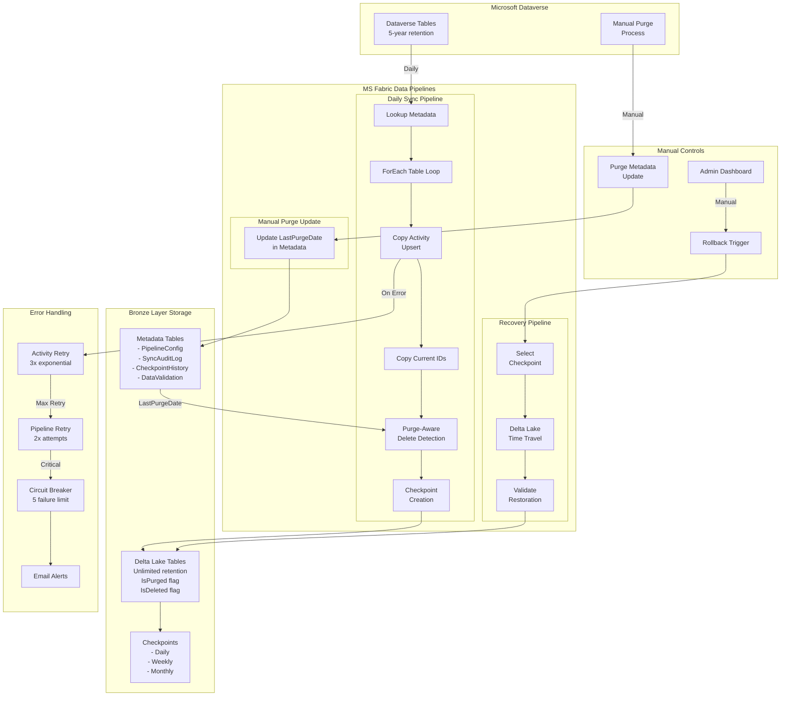

# Dataverse to MS Fabric Bronze Layer Synchronization
## Complete Project Documentation

---

# 1. Architecture Description

## Executive Summary

This architecture implements a robust data synchronization solution from Microsoft Dataverse to Microsoft Fabric Bronze Layer storage, designed to preserve complete historical data beyond Dataverse's 5-year retention limit while maintaining daily operational data currency.

## System Capabilities

### Core Functionality
- **Complete Data Synchronization**: Daily capture of all inserts, updates, and soft deletes from Dataverse
- **Purge-Aware Detection**: Intelligent differentiation between data purges (age-based removal) and intentional deletions
- **Historical Data Preservation**: Permanent retention of all data in Bronze layer, even after Dataverse purges
- **Point-in-Time Recovery**: Delta Lake checkpoints enabling rapid rollback to any previous state
- **Automated Error Handling**: Multi-tier retry logic with exponential backoff and circuit breaker patterns
- **Manual Fallback Controls**: Administrator-triggered rollback to validated checkpoints

### Data Retention Strategy
- **Dataverse**: 5 years + current year (system limitation with manual purges)
- **Fabric Bronze Layer**: Unlimited historical retention (includes purged records)
- **Checkpoint Retention**: Daily (7 days), Weekly (4 weeks), Monthly (12 months), Pre-purge (permanent)

## Technical Architecture

### Technology Stack
- **Source System**: Microsoft Dataverse
- **Target Platform**: Microsoft Fabric Lakehouse (Bronze Layer)
- **Storage Format**: Delta Lake tables with time travel capabilities
- **Integration Tools**: MS Fabric Data Pipelines, Copy Activities, SQL Scripts/Dataflow Gen2
- **Orchestration**: Metadata-driven ForEach loops with parameterized activities

### Data Flow Architecture

```
Dataverse → Daily Sync Pipeline → Bronze Layer (Current State)
                    ↓
            Soft Delete Detection
                    ↓
        Purge-Aware Classification
        (IsDeleted vs IsPurged)
                    ↓
            Daily Checkpoint Creation
                    
Manual Purge in Dataverse → Update Metadata → Next Sync Handles Automatically
```

### Key Technical Decisions

| Decision | Choice | Rationale |
|----------|--------|-----------|
| CDC Method | Copy Activity with Purge-Aware Detection | Simpler than Synapse Link, handles both deletes and purges |
| Storage Format | Delta Lake | ACID transactions, time travel, schema evolution |
| Purge Handling | Metadata-driven classification | No separate pipeline needed, automatic handling |
| Merge Strategy | SQL Scripts preferred, Dataflow Gen2 optional | SQL provides better control for complex logic |
| Orchestration | Metadata-driven pipelines | Eliminates per-table manual configuration |
| Failure Strategy | Checkpoint-based rollback | Rapid recovery without data loss |

## Error Handling & Recovery

### Automated Error Handling
1. **Activity-Level Retry**: 3 attempts with exponential backoff (2, 4, 8 minutes)
2. **Pipeline-Level Retry**: 2 attempts for transient failures
3. **Circuit Breaker**: Prevents cascade failures after 5 consecutive errors
4. **Graceful Degradation**: Individual table failures don't stop entire pipeline

### Manual Fallback Mechanism
1. **Checkpoint Selection**: Administrator selects from validated checkpoints
2. **Rollback Execution**: One-click restoration via parameterized pipeline
3. **Validation**: Automatic post-rollback data quality checks
4. **Audit Trail**: Complete logging of rollback operations

## Purge Management Strategy

### Purge vs Delete Differentiation
- **IsPurged = 1**: Records removed from Dataverse due to age (>5 years old)
  - Still valid for historical reporting
  - Not considered missing data
- **IsDeleted = 1**: Records intentionally deleted from Dataverse
  - Excluded from current reports
  - Represents actual data removal

### Purge Process Flow
1. Admin manually purges old data in Dataverse (annually)
2. Admin updates PipelineConfig.LastPurgeDate
3. Next daily sync automatically classifies missing records:
   - Old records (created before LastPurgeDate) → IsPurged = 1
   - Recent records (created after LastPurgeDate) → IsDeleted = 1

---

# 2. Implementation Plan

## Project Phases

### Phase 1: Foundation Setup (Week 1)
**Objective**: Establish core infrastructure and metadata framework

### Phase 2: Core Synchronization (Weeks 2-3)
**Objective**: Implement main sync pipeline with purge awareness

### Phase 3: Advanced Features (Week 4)
**Objective**: Checkpoint, recovery, and error handling systems

### Phase 4: Scale and Optimization (Week 5)
**Objective**: Multi-table scale testing and performance optimization

### Phase 5: Production Deployment (Week 6)
**Objective**: ACC/UAT testing and production release

## Feature & User Story Breakdown

### Feature 1: Foundation Setup
**Estimated Effort**: 32 hours

**User Stories**:

| ID | Story | Estimate | Acceptance Criteria |
|----|-------|----------|-------------------|
| FS-001 | As a data engineer, I need Bronze layer metadata tables with purge tracking | 8h | - PipelineConfig table created<br>- SyncAuditLog table created<br>- CheckpointHistory table created<br>- DataValidation table created |
| FS-002 | As a data engineer, I need Bronze layer tables with tracking columns | 8h | - Tables created in Bronze layer<br>- Tracking columns added<br>- Proper indexes created |
| FS-003 | As a data engineer, I need basic pipeline structure with Lookup activity | 8h | - Pipeline created<br>- Lookup activity configured<br>- Metadata connection tested |
| FS-004 | As a data engineer, I need parameterized ForEach orchestration framework | 8h | - ForEach activity created<br>- Parameter passing working<br>- Error handling framework |

### Feature 2: Core Data Synchronization
**Estimated Effort**: 72 hours

**User Stories**:

| ID | Story | Estimate | Acceptance Criteria |
|----|-------|----------|-------------------|
| CS-001 | As a data engineer, I need Copy Activity for Dataverse extraction | 12h | - Dynamic source query<br>- Parameterized destination<br>- Connection and auth working<br>- Single table tested |
| CS-002 | As a data engineer, I need tracking columns ensured after first sync | 8h | - Conditional column addition<br>- IsDeleted, IsPurged, LastSynced added<br>- Indexes created automatically |
| CS-003 | As a data engineer, I need ID extraction for comparison | 8h | - Current IDs extracted to temp table<br>- Performance optimized<br>- Cleanup logic included |
| CS-004 | As a data analyst, I need purge-aware soft delete detection | 16h | - Complex SQL logic implemented<br>- LastPurgeDate comparison working<br>- Deleted vs purged classification |
| CS-005 | As a system admin, I need execution logging and monitoring | 8h | - SyncAuditLog populated<br>- Performance metrics captured<br>- Error tracking implemented |
| CS-006 | As a data engineer, I need 3-table end-to-end testing | 20h | - Complete pipeline tested<br>- All scenarios validated<br>- Issues identified and fixed |

### Feature 3: Purge Management
**Estimated Effort**: 24 hours

| ID | Story | Estimate | Acceptance Criteria |
|----|-------|----------|-------------------|
| PM-001 | As a data admin, I need purge metadata management pipeline | 16h | - Pipeline for updating LastPurgeDate<br>- Validation and confirmation<br>- Audit trail maintained |
| PM-002 | As a data analyst, I need purge-aware reporting validation | 8h | - IsPurged flag properly set<br>- Historical data accessible<br>- Reports exclude deleted but include purged |

### Feature 4: Checkpoint & Recovery
**Estimated Effort**: 48 hours

| ID | Story | Estimate | Acceptance Criteria |
|----|-------|----------|-------------------|
| CR-001 | As a system admin, I need automated checkpoint creation | 12h | - Daily checkpoints created<br>- Retention policy applied<br>- CheckpointHistory updated |
| CR-002 | As a system admin, I need manual rollback capability | 20h | - Checkpoint selection pipeline<br>- Delta Lake time travel<br>- Validation after rollback |
| CR-003 | As a data analyst, I need rollback validation and testing | 12h | - Pre/post rollback comparison<br>- Quality metrics verified<br>- All scenarios tested |
| CR-004 | As a DevOps engineer, I need monitoring and alerting | 4h | - Email on failures<br>- Daily health reports<br>- Performance dashboards |

### Feature 5: Scale and Optimization
**Estimated Effort**: 32 hours

| ID | Story | Estimate | Acceptance Criteria |
|----|-------|----------|-------------------|
| SO-001 | As a data engineer, I need 10-table scale testing | 16h | - Performance with multiple tables<br>- Batch size optimization<br>- Resource utilization verified |
| SO-002 | As a data engineer, I need performance optimization | 8h | - Query optimization<br>- Index tuning<br>- Pipeline timing optimization |
| SO-003 | As a QA analyst, I need comprehensive integration testing | 8h | - All features tested together<br>- Load testing completed<br>- Performance benchmarks met |

### Feature 6: Production Deployment
**Estimated Effort**: 48 hours

| ID | Story | Estimate | Acceptance Criteria |
|----|-------|----------|-------------------|
| PD-001 | As a DevOps engineer, I need ACC environment setup | 16h | - Pipelines deployed to ACC<br>- Connections configured<br>- Security permissions set<br>- Test data scenarios ready |
| PD-002 | As a QA analyst, I need UAT test scenarios | 12h | - Test cases executed<br>- Defects logged and fixed<br>- Business sign-off obtained |
| PD-003 | As a DevOps engineer, I need production deployment | 8h | - Pipelines migrated<br>- Schedules activated<br>- Monitoring enabled |
| PD-004 | As a support analyst, I need operational documentation | 12h | - Runbook created<br>- Troubleshooting guide<br>- Training completed<br>- Support processes defined |

## Timeline & Milestones

```
Week 1: Foundation Setup
├── Mon-Tue: Metadata tables, Bronze layer tables with tracking
├── Wed-Thu: Basic pipeline structure and Lookup activity
└── Fri: ForEach orchestration framework

Week 2: Core Synchronization - Part 1
├── Mon-Tue: Copy Activity implementation and authentication
├── Wed-Thu: Tracking columns conditional addition
└── Fri: ID extraction and temp table logic

Week 3: Core Synchronization - Part 2
├── Mon-Tue: Purge-aware delete detection logic
├── Wed-Thu: Execution logging and monitoring
└── Fri: 3-table end-to-end testing

Week 4: Advanced Features
├── Mon-Tue: Purge metadata management pipeline
├── Wed-Thu: Checkpoint creation and rollback capabilities
└── Fri: Monitoring, alerting, and validation

Week 5: Scale and Optimization
├── Mon-Tue: 10-table scale testing and optimization
├── Wed-Thu: Performance tuning and load testing
└── Fri: Comprehensive integration testing

Week 6: Production Deployment
├── Mon-Tue: ACC environment setup and configuration
├── Wed-Thu: UAT execution and issue resolution
└── Fri: Production deployment and handover
```

## Environment Strategy

| Environment | Purpose | Data Source | Deployment Week |
|------------|---------|-------------|-----------------|
| DEV | Development & Testing | DEV D365 instance | Week 1-3 |
| ACC | Integration Testing & UAT | ACC D365 instance (copy of PROD) | Week 4 |
| PROD | Production Operations | PROD D365 instance | Week 5 |

---

# 3. System Architecture Diagram



---

# 4. Detailed Pipeline Setup

## Pipeline 1: Daily Sync Pipeline

### Pipeline Summary
**Six-activity approach for complete synchronization with purge awareness**:

```
Activity 1: Lookup - Get Enabled Tables
   - Source: PipelineConfig metadata table
   - Returns: Array of tables to process
   - Includes: LastPurgeDate for each table

Activity 2: ForEach - Process Tables
   Contains nested activities per table:
   
   Activity 2.1: Copy - Upsert Current Records
      - Source: Dataverse (all active records)
      - Destination: Bronze_Layer
      - Action: Upsert
      - Adds/Updates all current records
   
   Activity 2.1.5: Script - Ensure Tracking Columns
      - Conditional column addition
      - Adds IsDeleted, IsPurged, DeletedDate, PurgedDate, LastSynced
      - Creates indexes if columns don't exist
   
   Activity 2.2: Copy - Extract Current IDs
      - Source: Dataverse (just ID columns)
      - Destination: Temp_CurrentIDs table
      - Action: Overwrite
      - Lightweight operation for comparison
   
   Activity 2.3: Script - Purge-Aware Delete Detection
      - Compares current IDs with Bronze layer
      - Sets IsPurged = 1 for old missing records
      - Sets IsDeleted = 1 for recent missing records
      - Uses LastPurgeDate as cutoff
      - Updates LastSynced timestamp
   
   Activity 2.4: Script - Log Execution
      - Updates SyncAuditLog
      - Records metrics and status

Activity 3: If Condition - Create Checkpoint
   - Condition: All tables successful
   - Creates daily checkpoint for rollback
```

### Pipeline Parameters
```json
{
  "RunMode": "Daily",
  "MaxParallelTables": 5,
  "EnableCheckpoint": true
}
```

### Detailed Activity Configuration

#### Activity 1: Lookup - Get Enabled Tables
**Type**: Lookup
**Source**: SQL Query
```sql
SELECT 
    TableName, 
    PrimaryKeyColumn, 
    BronzeTableName, 
    SchemaName,
    LastPurgeDate,
    PurgeRecordCount
FROM PipelineConfig
WHERE SyncEnabled = 1
ORDER BY TableName
```
**Output**: Array of table configurations with purge metadata

#### Activity 2: ForEach - Process Tables
**Type**: ForEach
**Items**: `@activity('Get Enabled Tables').output.value`
**Batch Count**: 5
**Sequential**: False

**Inside ForEach Container:**

##### Activity 2.1: Copy - Upsert Records
**Type**: Copy Activity
**Source**: 
- Dataset: Dataverse
- Query: `SELECT * FROM @{item().SchemaName}.@{item().TableName} WHERE ModifiedOn >= DATEADD(day, -7, GETDATE())`
**Sink**:
- Dataset: Lakehouse
- Table: `@{item().BronzeTableName}`
- Write Method: Upsert
- Key Columns: `@{item().PrimaryKeyColumn}`
**Settings**:
- Retry: 3
- Retry Interval: 120 seconds
- Timeout: 30 minutes

##### Activity 2.1.5: Script - Ensure Tracking Columns
**Type**: Script Activity
**Script**:
```sql
-- Conditional column addition - only runs if columns don't exist
IF NOT EXISTS (
    SELECT * FROM INFORMATION_SCHEMA.COLUMNS 
    WHERE TABLE_NAME = '@{item().BronzeTableName}' 
    AND COLUMN_NAME = 'IsDeleted'
)
BEGIN
    ALTER TABLE @{item().BronzeTableName} ADD 
        IsDeleted BIT DEFAULT 0,
        IsPurged BIT DEFAULT 0,
        DeletedDate DATETIME NULL,
        PurgedDate DATETIME NULL,
        LastSynced DATETIME DEFAULT CURRENT_TIMESTAMP();
    
    -- Add indexes for performance
    CREATE INDEX IX_IsDeleted ON @{item().BronzeTableName} (IsDeleted);
    CREATE INDEX IX_IsPurged ON @{item().BronzeTableName} (IsPurged);
    CREATE INDEX IX_LastSynced ON @{item().BronzeTableName} (LastSynced DESC);
END
```

##### Activity 2.2: Copy - Extract Current IDs
**Type**: Copy Activity
**Source**:
- Dataset: Dataverse  
- Query: `SELECT @{item().PrimaryKeyColumn} FROM @{item().SchemaName}.@{item().TableName}`
**Sink**:
- Dataset: Lakehouse
- Table: `Temp_CurrentIDs_@{item().TableName}`
- Write Method: Overwrite

##### Activity 2.3: Script - Purge-Aware Delete Detection
**Type**: Script Activity
**Script**:
```sql
-- Get the LastPurgeDate for this table
DECLARE @LastPurgeDate DATETIME = '@{item().LastPurgeDate}';

-- Update records based on their status
UPDATE @{item().BronzeTableName}
SET 
    IsDeleted = CASE 
        WHEN @{item().PrimaryKeyColumn} NOT IN (
            SELECT @{item().PrimaryKeyColumn} 
            FROM Temp_CurrentIDs_@{item().TableName}
        )
        AND (CreatedDate >= ISNULL(@LastPurgeDate, '1900-01-01') OR @LastPurgeDate IS NULL)
        THEN 1  -- Recent record missing = deleted
        ELSE IsDeleted  -- Keep existing value
    END,
    IsPurged = CASE
        WHEN @{item().PrimaryKeyColumn} NOT IN (
            SELECT @{item().PrimaryKeyColumn} 
            FROM Temp_CurrentIDs_@{item().TableName}
        )
        AND @LastPurgeDate IS NOT NULL
        AND CreatedDate < @LastPurgeDate
        AND ISNULL(IsPurged, 0) = 0
        THEN 1  -- Old record missing after purge = purged
        ELSE IsPurged  -- Keep existing value
    END,
    LastSynced = CURRENT_TIMESTAMP()
WHERE @{item().PrimaryKeyColumn} NOT IN (
    SELECT @{item().PrimaryKeyColumn} 
    FROM Temp_CurrentIDs_@{item().TableName}
)
AND (ISNULL(IsDeleted, 0) = 0 OR ISNULL(IsPurged, 0) = 0);

-- Clean up temp table
DROP TABLE IF EXISTS Temp_CurrentIDs_@{item().TableName};
```

##### Activity 2.4: Script - Log Execution
**Type**: Script Activity
**Script**:
```sql
INSERT INTO SyncAuditLog (
    LogId, PipelineRunId, PipelineName, TableName, Operation,
    StartTime, EndTime, RowsProcessed, Status
)
VALUES (
    NEWID(),
    '@{pipeline().RunId}',
    'DailySync',
    '@{item().TableName}',
    'Upsert+PurgeAwareDelete',
    '@{pipeline().TriggerTime}',
    GETDATE(),
    @@ROWCOUNT,
    'Success'
);

UPDATE PipelineConfig
SET LastDailySync = CURRENT_TIMESTAMP()
WHERE TableName = '@{item().TableName}';
```

#### Activity 3: If Condition - Create Checkpoint
**Type**: If Condition
**Expression**: `@equals(pipeline().parameters.EnableCheckpoint, true)`

**True Branch:**

##### Activity 3.1: Script - Create Checkpoint
**Type**: Script Activity
**Script**:
```sql
-- Create checkpoint for all Bronze tables
DECLARE @CheckpointName NVARCHAR(100) = 'bronze_backup_' + CONVERT(VARCHAR(10), CURRENT_TIMESTAMP(), 120);

-- Use Delta Lake checkpoint command (pseudo-code, adjust for actual syntax)
EXEC CreateDeltaCheckpoint @CheckpointName;

INSERT INTO CheckpointHistory (
    CheckpointId, CheckpointName, CheckpointType, TablesIncluded,
    ValidationStatus, RetentionDate
)
SELECT 
    NEWID(),
    @CheckpointName,
    'Daily',
    COUNT(DISTINCT TableName),
    'Validated',
    DATEADD(day, 7, CURRENT_TIMESTAMP())
FROM PipelineConfig
WHERE SyncEnabled = 1;
```

### Error Handling Configuration

#### Activity: Error Handler Container
**Type**: Catch Block
**Scope**: Entire Pipeline

**Inside Error Handler:**

##### Activity E1: Script - Log Error
**Type**: Script Activity
```sql
INSERT INTO SyncAuditLog (
    LogId, PipelineRunId, PipelineName, Status, ErrorMessage
)
VALUES (
    NEWID(),
    '@{pipeline().RunId}',
    'DailySync',
    'Failed',
    '@{activity('ForEach').error.message}'
);
```

##### Activity E2: Web - Send Alert Email
**Type**: Web Activity
**Method**: POST
**URL**: `https://prod-xx.westeurope.logic.azure.com/workflows/email-alert`
**Body**:
```json
{
  "to": "dataops-team@company.com",
  "subject": "Daily Sync Pipeline Failure",
  "body": "Pipeline @{pipeline().RunId} failed at @{utcnow()}. Error: @{activity('ForEach').error.message}",
  "priority": "high"
}
```

## Pipeline 2: Manual Purge Metadata Update

### Pipeline Summary
**Simple two-activity pipeline to update purge metadata after Dataverse purge**:

```
Activity 1: Script - Update Purge Metadata
   - Updates LastPurgeDate for specified tables
   - Records purge event in audit log
   - Sets purge record count

Activity 2: Web - Send Confirmation
   - Notifies team of purge metadata update
   - Confirms next sync will handle purged records
```

### Pipeline Parameters
```json
{
  "TableNames": ["Table1", "Table2"],  // Or "All" for all tables
  "PurgeDate": "@{utcnow()}",
  "EstimatedPurgedRecords": 0
}
```

### Activity Configuration

#### Activity 1: Script - Update Purge Metadata
**Type**: Script Activity
**Script**:
```sql
-- Update purge metadata for specified tables
UPDATE PipelineConfig
SET 
    LastPurgeDate = '@{pipeline().parameters.PurgeDate}',
    PurgeRecordCount = @{pipeline().parameters.EstimatedPurgedRecords},
    ModifiedDate = CURRENT_TIMESTAMP(),
    ModifiedBy = '@{pipeline().RunId}'
WHERE 
    (@{pipeline().parameters.TableNames} = 'All' OR TableName IN (@{pipeline().parameters.TableNames}));

-- Log the purge event
INSERT INTO SyncAuditLog (
    LogId, PipelineRunId, PipelineName, TableName, Operation,
    StartTime, EndTime, Status, Notes
)
SELECT 
    NEWID(),
    '@{pipeline().RunId}',
    'PurgeMetadataUpdate',
    TableName,
    'PurgeRecorded',
    CURRENT_TIMESTAMP(),
    CURRENT_TIMESTAMP(),
    'Success',
    'Purge date recorded. Next sync will classify accordingly.'
FROM PipelineConfig
WHERE 
    (@{pipeline().parameters.TableNames} = 'All' OR TableName IN (@{pipeline().parameters.TableNames}));
```

#### Activity 2: Web - Send Confirmation
**Type**: Web Activity
**Method**: POST
**URL**: `https://prod-xx.westeurope.logic.azure.com/workflows/email-alert`
**Body**:
```json
{
  "to": "dataops-team@company.com",
  "subject": "Purge Metadata Updated",
  "body": "Purge metadata has been updated for @{pipeline().parameters.TableNames}. Next daily sync will properly classify purged records.",
  "priority": "normal"
}
```

## Pipeline 3: Manual Rollback Pipeline

### Pipeline Summary
**Three-activity approach for checkpoint-based recovery**:

```
Activity 1: Lookup - Validate Checkpoint
   - Verifies checkpoint exists
   - Returns checkpoint metadata
   - Confirms checkpoint is active

Activity 2: If Condition - Checkpoint Exists
   True Branch:
   
   Activity 2.1: ForEach - Restore Tables
      - Iterates through all tables
      - Restores each to checkpoint version
      - Logs restoration per table
   
   Activity 2.2: Script - Post-Rollback Validation
      - Validates data integrity
      - Updates validation metrics
      - Confirms successful rollback

   False Branch:
   - Send error notification
```

### Pipeline Parameters
```json
{
  "CheckpointName": "",
  "TablesScope": "All",
  "ValidateAfterRollback": true
}
```

### Activity Configuration

#### Activity 1: Lookup - Validate Checkpoint
**Type**: Lookup
```sql
SELECT CheckpointName, CreatedDate, TablesIncluded
FROM CheckpointHistory
WHERE CheckpointName = '@{pipeline().parameters.CheckpointName}'
  AND IsActive = 1
```

#### Activity 2: If - Checkpoint Exists
**Type**: If Condition
**Expression**: `@greater(activity('Validate Checkpoint').output.count, 0)`

**True Branch:**

##### Activity 2.1: ForEach - Restore Tables
**Type**: ForEach
**Items**: `@activity('Get Tables to Restore').output.value`

**Inside ForEach:**
```sql
-- Restore table to checkpoint
RESTORE TABLE @{item().BronzeTableName}
TO VERSION AS OF '@{pipeline().parameters.CheckpointName}';

-- Log restoration
INSERT INTO SyncAuditLog (
    LogId, PipelineRunId, PipelineName, TableName, Operation,
    StartTime, EndTime, Status, Notes
)
VALUES (
    NEWID(),
    '@{pipeline().RunId}',
    'ManualRollback',
    '@{item().TableName}',
    'Restore',
    CURRENT_TIMESTAMP(),
    CURRENT_TIMESTAMP(),
    'Success',
    'Restored to checkpoint: @{pipeline().parameters.CheckpointName}'
);
```

##### Activity 2.2: Script - Post-Rollback Validation
**Type**: Script Activity
```sql
-- Validate restoration
INSERT INTO DataValidation (
    ValidationId, ValidationDate, TableName, BronzeRowCount,
    ValidationPassed, Notes
)
SELECT 
    NEWID(),
    CURRENT_TIMESTAMP(),
    TableName,
    COUNT(*),
    1,
    'Post-rollback validation'
FROM @{item().BronzeTableName}
GROUP BY TableName;
```

**False Branch:**
- Send error notification that checkpoint doesn't exist

---

# 5. Metadata Tables Architecture

## Complete Metadata Table Definitions

### Purpose and Lifecycle

| Table | Purpose | Created When | Maintained By | Consumed By |
|-------|---------|--------------|---------------|-------------|
| **PipelineConfig** | Master control with purge tracking | Project setup | Manual updates + purge events | All pipelines via Lookup activity |
| **SyncAuditLog** | Execution history and troubleshooting | First pipeline run | Automatic by pipelines | Monitoring dashboards, troubleshooting |
| **CheckpointHistory** | Rollback point management | First checkpoint | Automatic after checkpoints | Rollback pipeline, retention cleanup |
| **DataValidation** | Data quality tracking | First validation run | Daily sync pipeline | Quality monitoring, alerts |

## Detailed Table Structures

```sql
-- 1. PipelineConfig: Master control table with purge tracking
CREATE TABLE PipelineConfig (
    TableId VARCHAR(36) NOT NULL,
    TableName NVARCHAR(100) NOT NULL,
    SchemaName NVARCHAR(50) NOT NULL DEFAULT 'dbo',
    PrimaryKeyColumn NVARCHAR(100) NOT NULL,
    BronzeTableName NVARCHAR(100) NOT NULL,
    SyncEnabled BIT NOT NULL DEFAULT 1,
    TrackDeletes BIT NOT NULL DEFAULT 1,
    -- Purge management fields
    LastPurgeDate DATETIME NULL,           -- When the last purge occurred
    PurgeRecordCount INT NULL,             -- Estimated records purged
    -- Sync tracking
    LastDailySync DATETIME NULL,
    CreatedDate DATETIME NOT NULL DEFAULT CURRENT_TIMESTAMP(),
    ModifiedDate DATETIME NOT NULL DEFAULT CURRENT_TIMESTAMP(),
    CONSTRAINT PK_PipelineConfig PRIMARY KEY (TableId)
);

-- Initial data load for 3-table pilot (using GUID format)
INSERT INTO PipelineConfig (TableId, TableName, SchemaName, PrimaryKeyColumn, BronzeTableName)
VALUES 
    ('a1b2c3d4-e5f6-7890-1234-567890abcdef', 'Account', 'dbo', 'AccountId', 'bronze_account'),
    ('b2c3d4e5-f6g7-8901-2345-6789012bcdef', 'Contact', 'dbo', 'ContactId', 'bronze_contact'),
    ('c3d4e5f6-g7h8-9012-3456-78901234cdef', 'ActivityPointer', 'dbo', 'ActivityId', 'bronze_activity');

-- 2. SyncAuditLog: Execution tracking
CREATE TABLE SyncAuditLog (
    LogId VARCHAR(36) NOT NULL,
    PipelineRunId NVARCHAR(100) NOT NULL,
    PipelineName NVARCHAR(100) NOT NULL,
    TableName NVARCHAR(100) NULL,
    Operation NVARCHAR(50) NOT NULL,
    StartTime DATETIME NOT NULL,
    EndTime DATETIME NULL,
    RowsProcessed INT NULL,
    RowsDeleted INT NULL,
    RowsPurged INT NULL,                   -- Track purged records
    Status NVARCHAR(20) NOT NULL,
    ErrorMessage STRING NULL,
    RetryCount INT NOT NULL DEFAULT 0,
    CreatedDate DATETIME NOT NULL DEFAULT CURRENT_TIMESTAMP(),
    CONSTRAINT PK_SyncAuditLog PRIMARY KEY (LogId)
);

-- Create indexes after table creation
CREATE INDEX IX_SyncAuditLog_PipelineRunId ON SyncAuditLog (PipelineRunId);
CREATE INDEX IX_SyncAuditLog_Status_Date ON SyncAuditLog (Status, CreatedDate DESC);

-- 3. CheckpointHistory: Fallback management
CREATE TABLE CheckpointHistory (
    CheckpointId VARCHAR(36) NOT NULL,
    CheckpointName NVARCHAR(100) NOT NULL,
    CheckpointType NVARCHAR(20) NOT NULL,
    CreatedDate DATETIME NOT NULL DEFAULT CURRENT_TIMESTAMP(),
    TablesIncluded INT NOT NULL,
    TotalRows BIGINT NULL,
    ValidationStatus NVARCHAR(20) NOT NULL DEFAULT 'Pending',
    RetentionDate DATE NOT NULL,
    IsActive BIT NOT NULL DEFAULT 1,
    CONSTRAINT PK_CheckpointHistory PRIMARY KEY (CheckpointId),
    CONSTRAINT UQ_CheckpointHistory_Name UNIQUE (CheckpointName)
);

-- Create indexes after table creation
CREATE INDEX IX_CheckpointHistory_Type_Active ON CheckpointHistory (CheckpointType, IsActive);
CREATE INDEX IX_CheckpointHistory_RetentionDate ON CheckpointHistory (RetentionDate);

-- 4. DataValidation: Quality tracking
CREATE TABLE DataValidation (
    ValidationId VARCHAR(36) NOT NULL,
    ValidationDate DATETIME NOT NULL DEFAULT CURRENT_TIMESTAMP(),
    TableName NVARCHAR(100) NOT NULL,
    SourceRowCount INT NULL,
    BronzeRowCount INT NOT NULL,
    ActiveRowCount INT NOT NULL,
    DeletedRowCount INT NOT NULL,
    PurgedRowCount INT NOT NULL,           -- Track purged records separately
    ValidationPassed BIT NOT NULL,
    CONSTRAINT PK_DataValidation PRIMARY KEY (ValidationId)
);

-- Create indexes after table creation
CREATE INDEX IX_DataValidation_Date_Table ON DataValidation (ValidationDate DESC, TableName);
CREATE INDEX IX_DataValidation_Passed ON DataValidation (ValidationPassed, ValidationDate DESC);
```

## Bronze Layer Table Structure

Each table in the Bronze layer should include these additional columns:

```sql
-- Example: Bronze layer table structure for Account table
ALTER TABLE bronze_account ADD
    -- Purge and delete tracking
    IsDeleted BIT DEFAULT 0,               -- Record was intentionally deleted
    IsPurged BIT DEFAULT 0,                -- Record was removed due to age-based purge
    DeletedDate DATETIME NULL,             -- When the deletion was detected
    PurgedDate DATETIME NULL,              -- When the purge was detected
    -- Metadata
    LastSynced DATETIME DEFAULT CURRENT_TIMESTAMP(),
    SyncDate DATETIME DEFAULT CURRENT_TIMESTAMP(),
    -- Indexes for performance
    INDEX IX_IsDeleted (IsDeleted),
    INDEX IX_IsPurged (IsPurged),
    INDEX IX_LastSynced (LastSynced DESC);
```

## Metadata Flow in Architecture

### Setup Phase (One-time)
```sql
-- 1. Create all metadata tables
-- Run scripts above

-- 2. Populate PipelineConfig with pilot tables
-- See INSERT statement in PipelineConfig section
```

### Daily Operations Flow
```
06:00 UTC - Daily Sync Pipeline
├── READ PipelineConfig WHERE SyncEnabled = 1
│   └── Including LastPurgeDate for each table
├── ForEach Table:
│   ├── Execute sync operations
│   ├── Apply purge-aware logic using LastPurgeDate
│   ├── WRITE to SyncAuditLog (per table)
│   └── UPDATE PipelineConfig.LastDailySync
├── WRITE to DataValidation (aggregate metrics)
└── If successful: WRITE to CheckpointHistory

07:00 UTC - Validation Check
├── READ latest from DataValidation
├── Compare thresholds (separate deleted vs purged)
└── If issues: Send alert
```

### Annual Purge Flow
```
Manual Trigger - Dataverse Purge Process
├── Admin executes purge in Dataverse
├── Admin triggers Purge Metadata Update pipeline
│   └── UPDATE PipelineConfig.LastPurgeDate = GETDATE()
├── Next Daily Sync automatically handles:
│   ├── Missing old records → IsPurged = 1
│   └── Missing recent records → IsDeleted = 1
└── WRITE to SyncAuditLog (purge event logged)
```

### Monitoring & Rollback Flow
```
On-Demand - System Health Check
├── READ recent from SyncAuditLog
│   └── Calculate success rates
├── READ latest from DataValidation
│   └── Check discrepancy thresholds
│   └── Monitor purged vs deleted ratios
└── READ from CheckpointHistory
    └── Verify checkpoint availability

Manual Trigger - Rollback
├── READ from CheckpointHistory WHERE CheckpointName = @param
├── Validate checkpoint exists and is active
├── Execute Delta Lake time travel
├── WRITE to SyncAuditLog (rollback operation)
└── UPDATE CheckpointHistory.RestoredCount
```

---

# 6. Risks and Additional Notes

## Risk Assessment

### High Priority Risks

| Risk | Impact | Probability | Mitigation |
|------|--------|-------------|------------|
| Delta Lake checkpoint corruption | Critical - Data loss | Low | Multiple checkpoint types, regular validation, backup to external storage |
| Dataverse API throttling | High - Sync delays | Medium | Implement adaptive throttling, batch size optimization, off-peak scheduling |
| Schema changes without notification | High - Pipeline failures | Medium | Schema drift detection, flexible mapping, email alerts on schema mismatch |
| Incorrect purge date update | High - Data misclassification | Low | Admin verification process, validation reports, ability to re-run classification |

### Medium Priority Risks

| Risk | Impact | Probability | Mitigation |
|------|--------|-------------|------------|
| ForEach loop timeout on large datasets | Medium - Incomplete sync | Medium | Batch size tuning, parallel execution, timeout configuration |
| Storage costs exceeding budget | Medium - Budget overrun | Medium | Retention policies, compression, tiered storage, regular capacity reviews |
| Purge-delete logic errors | Medium - Incorrect flags | Low | Thorough testing, validation queries, manual override capability |

### Low Priority Risks

| Risk | Impact | Probability | Mitigation |
|------|--------|-------------|------------|
| Metadata table corruption | Low - Operational issues | Low | Regular backups, audit logging, manual override options |
| Performance degradation over time | Low - Slow queries | Medium | Index optimization, partition pruning, statistics updates |

## Implementation Best Practices

### Development Guidelines

1. **Start Simple**: Begin with basic Copy Activity before adding purge logic
2. **Test Purge Scenarios**: Simulate purges in DEV environment thoroughly
3. **Document Assumptions**: Record any Dataverse-specific behaviors discovered
4. **Version Control**: Export pipeline JSON definitions to Git after major changes

### SQL Script vs Dataflow Gen2 Decision Matrix

| Scenario | Recommended | Reason |
|----------|-------------|--------|
| Simple upsert operations | Copy Activity | Native support, best performance |
| Purge-aware delete detection | SQL Script | Complex conditional logic easier to implement |
| Business rule transformations | Dataflow Gen2 | Visual design, business user friendly |
| High-volume batch processing | SQL Script | Better performance optimization |
| Cross-table validations | SQL Script | Complex joins easier to write |
| Data quality checks | Dataflow Gen2 | Built-in profiling capabilities |

### Performance Optimization Tips

1. **Batch Sizing**
   - Start with ForEach batch size of 5
   - Monitor CU consumption
   - Adjust based on table sizes

2. **Query Optimization**
   - Use date filters for incremental loads
   - Select only required columns
   - Index on IsDeleted, IsPurged, and LastSynced columns

3. **Storage Optimization**
   - Enable compression on Bronze tables
   - Implement partition pruning by date
   - Regular OPTIMIZE commands on Delta tables

### Monitoring Checklist

**Daily Checks**:
- [ ] All pipelines completed successfully
- [ ] Data validation discrepancies < 1%
- [ ] No unexpected deleted/purged records
- [ ] Checkpoint created successfully

**Weekly Checks**:
- [ ] Storage growth within projections
- [ ] Performance metrics stable
- [ ] Error rate < 5%
- [ ] Review purged vs deleted ratios

**Monthly Checks**:
- [ ] Capacity utilization review
- [ ] Cost analysis vs budget
- [ ] Schema drift assessment
- [ ] Disaster recovery test

**Annual Checks** (Before Purge):
- [ ] Verify all tables synced successfully
- [ ] Create pre-purge checkpoint
- [ ] Document records to be purged
- [ ] Update purge metadata after Dataverse purge

### Purge Process Checklist

**Pre-Purge**:
1. [ ] Run full sync to ensure Bronze layer is current
2. [ ] Create named checkpoint (e.g., "PRE_PURGE_2025")
3. [ ] Generate report of records that will be purged
4. [ ] Get approval from data governance team

**During Purge**:
1. [ ] Execute purge in Dataverse
2. [ ] Document number of records purged per table
3. [ ] Update PipelineConfig.LastPurgeDate immediately

**Post-Purge**:
1. [ ] Run daily sync to apply purge classification
2. [ ] Validate IsPurged flags are set correctly
3. [ ] Verify no unexpected data loss
4. [ ] Send confirmation report to stakeholders

### JSON Export Considerations

While manual configuration is recommended, JSON export/import can be useful for:

1. **Backup and Version Control**
```powershell
# Export pipeline definition
Export-FabricPipeline -Name "DailySync" -Path "./pipelines/daily-sync.json"

# Import to new environment
Import-FabricPipeline -Path "./pipelines/daily-sync.json" -Workspace "Production"
```

2. **Environment Promotion**
- Export from DEV after testing
- Modify connection strings for ACC/PROD
- Import with environment-specific parameters

3. **Bulk Table Configuration** (Only if necessary)
```python
# Generate pipeline config for 100+ tables
import json

tables = ["Table1", "Table2", ...] # From Dataverse metadata
pipeline_template = json.load("template.json")

for table in tables:
    activity = create_copy_activity(table)
    pipeline_template['activities'].append(activity)

json.dump(pipeline_template, "generated-pipeline.json")
```

**Note**: Avoid programmatic generation unless dealing with 50+ similar tables. Manual configuration is more maintainable for most scenarios.

### Reporting Considerations

When building reports on Bronze layer data:

1. **Current State Reports**:
```sql
SELECT * FROM bronze_table
WHERE IsDeleted = 0 AND IsPurged = 0
```

2. **Historical Reports** (including purged data):
```sql
SELECT * FROM bronze_table
WHERE IsDeleted = 0  -- Include purged but not deleted
```

3. **Complete Audit Reports**:
```sql
SELECT *,
    CASE 
        WHEN IsDeleted = 1 THEN 'Deleted'
        WHEN IsPurged = 1 THEN 'Purged'
        ELSE 'Active'
    END as RecordStatus
FROM bronze_table
```

### Support Contacts and Escalation

1. **Level 1**: Pipeline failure alerts → Data Operations Team
2. **Level 2**: Schema or permission issues → Dataverse Admin Team
3. **Level 3**: Infrastructure or capacity → MS Fabric Platform Team
4. **Emergency**: Data loss or corruption → Senior Management + Microsoft Support

### Success Criteria

**Technical Success**:
- 99.5% daily sync success rate
- < 5 minute recovery time for rollback
- Zero data loss during purge process
- Correct classification of purged vs deleted records
- < 1% data discrepancy rate

**Business Success**:
- Complete historical data retention achieved
- Daily reports available by 8 AM
- Successful completion of first annual purge cycle
- Accurate historical reporting despite source purges
- Stakeholder satisfaction > 90%

---

## Document Version Control

| Version | Date | Author | Changes |
|---------|------|--------|---------|
| 1.0 | 2024-01-15 | Initial | Complete documentation package |
| 2.0 | 2024-01-15 | Revised | Removed Historical Preservation Pipeline, added purge-aware detection |
| 3.0 | 2024-01-16 | Updated | Trimmed metadata tables, refined implementation plan, added column tracking |

## Approval Sign-offs

| Role | Name | Date | Signature |
|------|------|------|-----------|
| Product Manager | | | |
| Technical Architect | | | |
| Data Governance Lead | | | |
| DevOps Manager | | | |