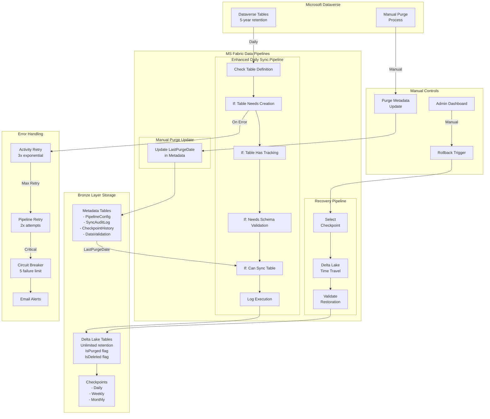

# Dataverse to MS Fabric Bronze Layer Synchronization
## Complete Project Documentation

---

# 1. Architecture Description

## Executive Summary

This architecture implements a robust data synchronization solution from Microsoft Dataverse to Microsoft Fabric Bronze Layer storage, designed to preserve complete historical data beyond Dataverse's 5-year retention limit while maintaining daily operational data currency.

## System Capabilities

### Core Functionality
- **Complete Data Synchronization**: Daily capture of all inserts, updates, and soft deletes from Dataverse
- **Purge-Aware Detection**: Intelligent differentiation between data purges (age-based removal) and intentional deletions
- **Historical Data Preservation**: Permanent retention of all data in Bronze layer, even after Dataverse purges
- **Point-in-Time Recovery**: Delta Lake checkpoints enabling rapid rollback to any previous state
- **Automated Error Handling**: Multi-tier retry logic with exponential backoff and circuit breaker patterns
- **Manual Fallback Controls**: Administrator-triggered rollback to validated checkpoints
- **Dynamic Schema Management**: Automatic table creation with schema detection and drift handling
- **Manual Table Exceptions**: Skip problematic tables that require manual setup

### Data Retention Strategy
- **Dataverse**: 5 years + current year (system limitation with manual purges)
- **Fabric Bronze Layer**: Unlimited historical retention (includes purged records)
- **Checkpoint Retention**: Daily (7 days), Weekly (4 weeks), Monthly (12 months), Pre-purge (permanent)

## Technical Architecture

### Technology Stack
- **Source System**: Microsoft Dataverse
- **Target Platform**: Microsoft Fabric Lakehouse (Bronze Layer)
- **Storage Format**: Delta Lake tables with time travel capabilities
- **Integration Tools**: MS Fabric Data Pipelines, Copy Activities, Notebooks with PySpark
- **Orchestration**: Metadata-driven ForEach loops with conditional processing

### Data Flow Architecture

```
Dataverse → Daily Sync Pipeline → Bronze Layer (Current State)
                    ↓
        1. Check Table Definition
                    ↓
        2. Create Table if Needed
                    ↓
        3. Add Tracking Columns
                    ↓
        4. Handle Schema Drift
                    ↓
        5. Sync Data Operations
                    ↓
        6. Purge-Aware Classification
                    ↓
        7. Log Execution
                    
Manual Purge in Dataverse → Update Metadata → Next Sync Handles Automatically
```

### Key Technical Decisions

| Decision | Choice | Rationale |
|----------|--------|-----------|
| CDC Method | Copy Activity with Purge-Aware Detection | Simpler than Synapse Link, handles both deletes and purges |
| Storage Format | Delta Lake | ACID transactions, time travel, schema evolution |
| Purge Handling | Metadata-driven classification | No separate pipeline needed, automatic handling |
| Table Creation | Dynamic FetchXML with auto-schema import | Maintains full schema detection while handling exceptions |
| Schema Management | Four-stage conditional processing | Clean separation of concerns with required_actions array |
| Manual Exceptions | Skip problematic tables via do_not_sync flag | Allows manual setup of complex tables like activitypointer |
| Orchestration | Metadata-driven pipelines | Eliminates per-table manual configuration |
| Failure Strategy | Checkpoint-based rollback | Rapid recovery without data loss |

## Error Handling & Recovery

### Automated Error Handling
1. **Activity-Level Retry**: 3 attempts with exponential backoff (2, 4, 8 minutes)
2. **Pipeline-Level Retry**: 2 attempts for transient failures
3. **Circuit Breaker**: Prevents cascade failures after 5 consecutive errors
4. **Graceful Degradation**: Individual table failures don't stop entire pipeline

### Manual Fallback Mechanism
1. **Checkpoint Selection**: Administrator selects from validated checkpoints
2. **Rollback Execution**: One-click restoration via parameterized pipeline
3. **Validation**: Automatic post-rollback data quality checks
4. **Audit Trail**: Complete logging of rollback operations

## Purge Management Strategy

### Purge vs Delete Differentiation
- **IsPurged = 1**: Records removed from Dataverse due to age (>5 years old)
  - Still valid for historical reporting
  - Not considered missing data
- **IsDeleted = 1**: Records intentionally deleted from Dataverse
  - Excluded from current reports
  - Represents actual data removal

### Purge Process Flow
1. Admin manually purges old data in Dataverse (annually)
2. Admin updates PipelineConfig.LastPurgeDate
3. Next daily sync automatically classifies missing records:
   - Old records (created before LastPurgeDate) → IsPurged = 1
   - Recent records (created after LastPurgeDate) → IsDeleted = 1

---

# 2. Implementation Plan

## Project Phases

### Phase 1: Foundation Setup (Week 1)
**Objective**: Establish core infrastructure and metadata framework

### Phase 2: Core Synchronization (Weeks 2-3)
**Objective**: Implement main sync pipeline with purge awareness

### Phase 3: Advanced Features (Week 4)
**Objective**: Checkpoint, recovery, and error handling systems

### Phase 4: Scale and Optimization (Week 5)
**Objective**: Multi-table scale testing and performance optimization

### Phase 5: Production Deployment (Week 6)
**Objective**: ACC/UAT testing and production release

## Feature & User Story Breakdown

### Feature 1: Foundation Setup
**Estimated Effort**: 32 hours

**User Stories**:

| ID | Story | Estimate | Acceptance Criteria |
|----|-------|----------|-------------------|
| FS-001 | As a data engineer, I need Bronze layer metadata tables with purge tracking | 8h | - PipelineConfig table created<br>- SyncAuditLog table created<br>- CheckpointHistory table created<br>- DataValidation table created |
| FS-002 | As a data engineer, I need Bronze layer tables with tracking columns | 8h | - Tables created in Bronze layer<br>- Tracking columns added<br>- Proper indexes created |
| FS-003 | As a data engineer, I need basic pipeline structure with Lookup activity | 8h | - Pipeline created<br>- Lookup activity configured<br>- Metadata connection tested |
| FS-004 | As a data engineer, I need parameterized ForEach orchestration framework | 8h | - ForEach activity created<br>- Parameter passing working<br>- Error handling framework |

### Feature 2: Core Data Synchronization
**Estimated Effort**: 72 hours

**User Stories**:

| ID | Story | Estimate | Acceptance Criteria |
|----|-------|----------|-------------------|
| CS-001 | As a data engineer, I need Copy Activity for Dataverse extraction | 12h | - Dynamic source query<br>- Parameterized destination<br>- Connection and auth working<br>- Single table tested |
| CS-002 | As a data engineer, I need tracking columns ensured after first sync | 8h | - Conditional column addition<br>- IsDeleted, IsPurged, LastSynced added<br>- Indexes created automatically |
| CS-003 | As a data engineer, I need ID extraction for comparison | 8h | - Current IDs extracted to temp table<br>- Performance optimized<br>- Cleanup logic included |
| CS-004 | As a data analyst, I need purge-aware soft delete detection | 16h | - Complex SQL logic implemented<br>- LastPurgeDate comparison working<br>- Deleted vs purged classification |
| CS-005 | As a system admin, I need execution logging and monitoring | 8h | - SyncAuditLog populated<br>- Performance metrics captured<br>- Error tracking implemented |
| CS-006 | As a data engineer, I need 3-table end-to-end testing | 20h | - Complete pipeline tested<br>- All scenarios validated<br>- Issues identified and fixed |

### Feature 3: Purge Management
**Estimated Effort**: 24 hours

| ID | Story | Estimate | Acceptance Criteria |
|----|-------|----------|-------------------|
| PM-001 | As a data admin, I need purge metadata management pipeline | 16h | - Pipeline for updating LastPurgeDate<br>- Validation and confirmation<br>- Audit trail maintained |
| PM-002 | As a data analyst, I need purge-aware reporting validation | 8h | - IsPurged flag properly set<br>- Historical data accessible<br>- Reports exclude deleted but include purged |

### Feature 4: Checkpoint & Recovery
**Estimated Effort**: 48 hours

| ID | Story | Estimate | Acceptance Criteria |
|----|-------|----------|-------------------|
| CR-001 | As a system admin, I need automated checkpoint creation | 12h | - Daily checkpoints created<br>- Retention policy applied<br>- CheckpointHistory updated |
| CR-002 | As a system admin, I need manual rollback capability | 20h | - Checkpoint selection pipeline<br>- Delta Lake time travel<br>- Validation after rollback |
| CR-003 | As a data analyst, I need rollback validation and testing | 12h | - Pre/post rollback comparison<br>- Quality metrics verified<br>- All scenarios tested |
| CR-004 | As a DevOps engineer, I need monitoring and alerting | 4h | - Email on failures<br>- Daily health reports<br>- Performance dashboards |

### Feature 5: Scale and Optimization
**Estimated Effort**: 32 hours

| ID | Story | Estimate | Acceptance Criteria |
|----|-------|----------|-------------------|
| SO-001 | As a data engineer, I need 10-table scale testing | 16h | - Performance with multiple tables<br>- Batch size optimization<br>- Resource utilization verified |
| SO-002 | As a data engineer, I need performance optimization | 8h | - Query optimization<br>- Index tuning<br>- Pipeline timing optimization |
| SO-003 | As a QA analyst, I need comprehensive integration testing | 8h | - All features tested together<br>- Load testing completed<br>- Performance benchmarks met |

### Feature 6: Production Deployment
**Estimated Effort**: 48 hours

| ID | Story | Estimate | Acceptance Criteria |
|----|-------|----------|-------------------|
| PD-001 | As a DevOps engineer, I need ACC environment setup | 16h | - Pipelines deployed to ACC<br>- Connections configured<br>- Security permissions set<br>- Test data scenarios ready |
| PD-002 | As a QA analyst, I need UAT test scenarios | 12h | - Test cases executed<br>- Defects logged and fixed<br>- Business sign-off obtained |
| PD-003 | As a DevOps engineer, I need production deployment | 8h | - Pipelines migrated<br>- Schedules activated<br>- Monitoring enabled |
| PD-004 | As a support analyst, I need operational documentation | 12h | - Runbook created<br>- Troubleshooting guide<br>- Training completed<br>- Support processes defined |

## Timeline & Milestones

```
Week 1: Foundation Setup
├── Mon-Tue: Metadata tables, Bronze layer tables with tracking
├── Wed-Thu: Basic pipeline structure and Lookup activity
└── Fri: ForEach orchestration framework

Week 2: Core Synchronization - Part 1
├── Mon-Tue: Copy Activity implementation and authentication
├── Wed-Thu: Tracking columns conditional addition
└── Fri: ID extraction and temp table logic

Week 3: Core Synchronization - Part 2
├── Mon-Tue: Purge-aware delete detection logic
├── Wed-Thu: Execution logging and monitoring
└── Fri: 3-table end-to-end testing

Week 4: Advanced Features
├── Mon-Tue: Purge metadata management pipeline
├── Wed-Thu: Checkpoint creation and rollback capabilities
└── Fri: Monitoring, alerting, and validation

Week 5: Scale and Optimization
├── Mon-Tue: 10-table scale testing and optimization
├── Wed-Thu: Performance tuning and load testing
└── Fri: Comprehensive integration testing

Week 6: Production Deployment
├── Mon-Tue: ACC environment setup and configuration
├── Wed-Thu: UAT execution and issue resolution
└── Fri: Production deployment and handover
```

## Environment Strategy

| Environment | Purpose | Data Source | Deployment Week |
|------------|---------|-------------|-----------------|
| DEV | Development & Testing | DEV D365 instance | Week 1-3 |
| ACC | Integration Testing & UAT | ACC D365 instance (copy of PROD) | Week 4 |
| PROD | Production Operations | PROD D365 instance | Week 5 |

---

# 3. System Architecture Diagram



---

# 4. Detailed Pipeline Setup

## Pipeline 1: Enhanced Daily Sync Pipeline

### Updated Pipeline Structure

```
Activity 1: Lookup - Get Enabled Tables
Activity 2: ForEach - Process Tables
├── Activity 2.0: Notebook - Check Table Definition
├── Activity 2.1: If Condition - Table Needs to Be Created
│   ├── True Branch: Copy Activity - Create New Table → Notebook - Truncate Table
│   └── False Branch: Skip
├── Activity 2.2: If Condition - Table Has Tracking Columns  
│   ├── True Branch: Skip (already has tracking columns)
│   └── False Branch: Notebook - Add Tracking Columns
├── Activity 2.3: If Condition - Needs Schema Validation
│   ├── True Branch: Notebook - Handle Schema Drift
│   └── False Branch: Skip
├── Activity 2.4: If Condition - Can Sync Table
│   ├── True Branch: Sync Operations
│   │   ├── Copy Activity - Upsert Current Records
│   │   ├── Copy Activity - Extract Current IDs
│   │   └── Notebook - Purge-Aware Delete Detection
│   └── False Branch: Skip sync
└── Activity 2.5: Notebook - Log Execution
```

### Pipeline Summary
**Multi-stage conditional processing approach for complete synchronization with dynamic schema management**:

```
Activity 1: Lookup - Get Enabled Tables
   - Source: PipelineConfig metadata table
   - Returns: Array of tables to process
   - Includes: LastPurgeDate and table configuration

Activity 2: ForEach - Process Tables
   Contains sequential conditional activities per table:
   
   Activity 2.0: Notebook - Check Table Definition
      - Determines table existence and required actions
      - Handles manual creation exceptions
      - Returns: required_actions array and do_not_sync flag
   
   Activity 2.1: If Condition - Table Needs to Be Created
      True Branch:
         - Copy Activity: Create New Table with auto-schema import
         - Notebook: Truncate table to remove schema detection data
      False Branch: Skip
   
   Activity 2.2: If Condition - Table Has Tracking Columns
      True Branch: Skip (already has tracking)
      False Branch: Notebook - Add Tracking Columns
   
   Activity 2.3: If Condition - Needs Schema Validation  
      True Branch: Notebook - Handle Schema Drift
      False Branch: Skip
   
   Activity 2.4: If Condition - Can Sync Table
      True Branch: Sync Operations
         - Copy Activity: Upsert Current Records
         - Copy Activity: Extract Current IDs
         - Notebook: Purge-Aware Delete Detection
      False Branch: Skip sync
   
   Activity 2.5: Notebook - Log Execution
      - Updates SyncAuditLog with execution results
      - Records metrics and status regardless of sync outcome
```

### Pipeline Parameters
```json
{
  "RunMode": "Daily",
  "MaxParallelTables": 5,
  "EnableCheckpoint": true
}
```

### Detailed Activity Configuration

#### Activity 1: Lookup - Get Enabled Tables
**Type**: Lookup
**Source**: SQL Query
```sql
SELECT 
    TableName, 
    PrimaryKeyColumn, 
    SchemaName,
    LastPurgeDate,
    PurgeRecordCount
FROM PipelineConfig
WHERE SyncEnabled = 1
ORDER BY TableName
```
**Output**: Array of table configurations with purge metadata

#### Activity 2: ForEach - Process Tables
**Type**: ForEach
**Items**: `@activity('Get Enabled Tables').output.value`
**Batch Count**: 5
**Sequential**: False

**Inside ForEach Container:**

##### Activity 2.0: Notebook - Check Table Definition
**Type**: Notebook Activity
**Notebook**: CheckTableDefinition
**Parameters**:
```json
{
  "TableName": "@{item().TableName}"
}
```
**Expression References for Pipeline**:
- Table creation check: `@contains(json(activity('Check Table Definition').output.result.exitValue).required_actions, 'CREATE_TABLE')`
- Tracking columns check: `@not(contains(json(activity('Check Table Definition').output.result.exitValue).required_actions, 'ADD_TRACKING_COLUMNS'))`
- Schema validation check: `@contains(json(activity('Check Table Definition').output.result.exitValue).required_actions, 'VALIDATE_SCHEMA')`
- Can sync check: `@not(json(activity('Check Table Definition').output.result.exitValue).do_not_sync)`

##### Activity 2.1: If Condition - Table Needs to Be Created
**Type**: If Condition
**Expression**: `@contains(json(activity('Check Table Definition').output.result.exitValue).required_actions, 'CREATE_TABLE')`

**True Branch:**

###### Copy Activity - Create New Table
**Type**: Copy Activity
**Source**: 
- Dataset: Dataverse
- Query Type: FetchXML
- Query: 
```xml
<fetch top="1">
  <entity name="@{item().TableName}">
    <all-attributes />
    <order attribute="modifiedon" descending="true" />
  </entity>
</fetch>
```
**Sink**:
- Dataset: Lakehouse
- Table: `@{item().TableName}`
- Table Action: Create table
- Write Method: Insert

###### Notebook - Truncate Table
**Type**: Notebook Activity
**Notebook**: TruncateTable
**Parameters**:
```json
{
  "TableName": "@{item().TableName}"
}
```

##### Activity 2.2: If Condition - Table Has Tracking Columns
**Type**: If Condition  
**Expression**: `@not(contains(json(activity('Check Table Definition').output.result.exitValue).required_actions, 'ADD_TRACKING_COLUMNS'))`

**False Branch - Notebook: Add Tracking Columns**
**Type**: Notebook Activity
**Notebook**: AddTrackingColumns
**Parameters**:
```json
{
  "TableName": "@{item().TableName}"
}
```

##### Activity 2.3: If Condition - Needs Schema Validation
**Type**: If Condition
**Expression**: `@contains(json(activity('Check Table Definition').output.result.exitValue).required_actions, 'VALIDATE_SCHEMA')`

**True Branch - Notebook: Handle Schema Drift**
**Type**: Notebook Activity
**Notebook**: HandleSchemaDrift
**Parameters**:
```json
{
  "TableName": "@{item().TableName}"
}
```

##### Activity 2.4: If Condition - Can Sync Table
**Type**: If Condition
**Expression**: `@not(json(activity('Check Table Definition').output.result.exitValue).do_not_sync)`

**True Branch - Sync Operations:**

###### Copy Activity - Upsert Current Records
**Type**: Copy Activity
**Source**: 
- Dataset: Dataverse
- Query: `<fetch><entity name="@{item().TableName}"><all-attributes /></entity></fetch>`
**Sink**:
- Dataset: Lakehouse
- Table: `@{item().TableName}`
- Write Method: Upsert
- Key Columns: `@{item().PrimaryKeyColumn}`

###### Copy Activity - Extract Current IDs
**Type**: Copy Activity
**Source**:
- Dataset: Dataverse  
- Query: `<fetch><entity name="@{item().TableName}"><attribute name="@{item().PrimaryKeyColumn}" /></entity></fetch>`
**Sink**:
- Dataset: Lakehouse
- Table: `Temp_CurrentIDs_@{item().TableName}`
- Write Method: Overwrite

###### Notebook - Purge-Aware Delete Detection
**Type**: Notebook Activity
**Notebook**: PurgeAwareDetection
**Parameters**:
```json
{
  "TableName": "@{item().TableName}",
  "PrimaryKeyColumn": "@{item().PrimaryKeyColumn}",
  "LastPurgeDate": "@{item().LastPurgeDate}"
}
```

##### Activity 2.5: Notebook - Log Execution
**Type**: Notebook Activity
**Notebook**: LogExecution
**Parameters**:
```json
{
  "TableName": "@{item().TableName}",
  "PipelineRunId": "@{pipeline().RunId}"
}
```

### Error Handling Configuration

#### Activity: Error Handler Container
**Type**: Catch Block
**Scope**: Entire Pipeline

**Inside Error Handler:**

##### Activity E1: Notebook - Log Error
**Type**: Notebook Activity

##### Activity E2: Web - Send Alert Email
**Type**: Web Activity
**Method**: POST
**URL**: `https://prod-xx.westeurope.logic.azure.com/workflows/email-alert`
**Body**:
```json
{
  "to": "dataops-team@company.com",
  "subject": "Daily Sync Pipeline Failure",
  "body": "Pipeline @{pipeline().RunId} failed at @{utcnow()}. Error: @{activity('ForEach').error.message}",
  "priority": "high"
}
```

## Pipeline 2: Manual Purge Metadata Update

### Pipeline Summary
**Simple two-activity pipeline to update purge metadata after Dataverse purge**:

```
Activity 1: Notebook - Update Purge Metadata
   - Updates LastPurgeDate for specified tables
   - Records purge event in audit log
   - Sets purge record count

Activity 2: Web - Send Confirmation
   - Notifies team of purge metadata update
   - Confirms next sync will handle purged records
```

### Pipeline Parameters
```json
{
  "TableNames": ["Table1", "Table2"],  // Or "All" for all tables
  "PurgeDate": "@{utcnow()}",
  "EstimatedPurgedRecords": 0
}
```

### Activity Configuration

#### Activity 1: Notebook - Update Purge Metadata
**Type**: Notebook Activity

#### Activity 2: Web - Send Confirmation
**Type**: Web Activity
**Method**: POST
**URL**: `https://prod-xx.westeurope.logic.azure.com/workflows/email-alert`
**Body**:
```json
{
  "to": "dataops-team@company.com",
  "subject": "Purge Metadata Updated",
  "body": "Purge metadata has been updated for @{pipeline().parameters.TableNames}. Next daily sync will properly classify purged records.",
  "priority": "normal"
}
```

## Pipeline 3: Manual Rollback Pipeline

### Pipeline Summary
**Three-activity approach for checkpoint-based recovery**:

```
Activity 1: Lookup - Validate Checkpoint
   - Verifies checkpoint exists
   - Returns checkpoint metadata
   - Confirms checkpoint is active

Activity 2: If Condition - Checkpoint Exists
   True Branch:
   
   Activity 2.1: ForEach - Restore Tables
      - Iterates through all tables
      - Restores each to checkpoint version
      - Logs restoration per table
   
   Activity 2.2: Notebook - Post-Rollback Validation
      - Validates data integrity
      - Updates validation metrics
      - Confirms successful rollback

   False Branch:
   - Send error notification
```

### Pipeline Parameters
```json
{
  "CheckpointName": "",
  "TablesScope": "All",
  "ValidateAfterRollback": true
}
```

### Activity Configuration

#### Activity 1: Lookup - Validate Checkpoint
**Type**: Lookup
```sql
SELECT CheckpointName, CreatedDate, TablesIncluded
FROM CheckpointHistory
WHERE CheckpointName = '@{pipeline().parameters.CheckpointName}'
  AND IsActive = 1
```

#### Activity 2: If - Checkpoint Exists
**Type**: If Condition
**Expression**: `@greater(activity('Validate Checkpoint').output.count, 0)`

**True Branch:**

##### Activity 2.1: ForEach - Restore Tables
**Type**: ForEach
**Items**: `@activity('Get Tables to Restore').output.value`

**Inside ForEach:**
```sql
-- Restore table to checkpoint
RESTORE TABLE @{item().TableName}
TO VERSION AS OF '@{pipeline().parameters.CheckpointName}';

-- Log restoration
INSERT INTO SyncAuditLog (
    LogId, PipelineRunId, PipelineName, TableName, Operation,
    StartTime, EndTime, Status, Notes
)
VALUES (
    NEWID(),
    '@{pipeline().RunId}',
    'ManualRollback',
    '@{item().TableName}',
    'Restore',
    CURRENT_TIMESTAMP(),
    CURRENT_TIMESTAMP(),
    'Success',
    'Restored to checkpoint: @{pipeline().parameters.CheckpointName}'
);
```

##### Activity 2.2: Notebook - Post-Rollback Validation
**Type**: Notebook Activity

**False Branch:**
- Send error notification that checkpoint doesn't exist

---

# 5. Metadata Tables Architecture

## Complete Metadata Table Definitions

### Purpose and Lifecycle

| Table | Purpose | Created When | Maintained By | Consumed By |
|-------|---------|--------------|---------------|-------------|
| **PipelineConfig** | Master control with purge tracking | Project setup | Manual updates + purge events | All pipelines via Lookup activity |
| **SyncAuditLog** | Execution history and troubleshooting | First pipeline run | Automatic by pipelines | Monitoring dashboards, troubleshooting |
| **CheckpointHistory** | Rollback point management | First checkpoint | Automatic after checkpoints | Rollback pipeline, retention cleanup |
| **DataValidation** | Data quality tracking | First validation run | Daily sync pipeline | Quality monitoring, alerts |

## Detailed Table Structures

### Setup Requirements
1. **Create a Notebook** in your MS Fabric workspace
2. **Attach your Lakehouse** to the notebook
3. **Execute the Spark SQL commands** below to create metadata tables

### Metadata Table Creation - Spark SQL Notebook

```sql
-- 1. PipelineConfig: Master control table with purge tracking
CREATE TABLE IF NOT EXISTS PipelineConfig (
    TableId STRING NOT NULL,
    TableName STRING NOT NULL,
    SchemaName STRING NOT NULL,
    PrimaryKeyColumn STRING NOT NULL,
    SyncEnabled BOOLEAN NOT NULL,
    TrackDeletes BOOLEAN NOT NULL,
    LastPurgeDate TIMESTAMP,
    PurgeRecordCount INT,
    LastDailySync TIMESTAMP,
    CreatedDate TIMESTAMP NOT NULL,
    ModifiedDate TIMESTAMP NOT NULL
) USING DELTA;
```

```sql
-- Insert initial pilot data (using GUID format)
INSERT INTO PipelineConfig 
(TableId, TableName, SchemaName, PrimaryKeyColumn, SyncEnabled, TrackDeletes, CreatedDate, ModifiedDate)
SELECT 'a1b2c3d4-e5f6-7890-1234-567890abcdef', 'account', 'dbo', 'accountid', true, true, current_timestamp(), current_timestamp()
UNION ALL
SELECT 'b2c3d4e5-f6g7-8901-2345-6789012bcdef', 'donation', 'dbo', 'donationid', true, true, current_timestamp(), current_timestamp()
UNION ALL
SELECT 'c3d4e5f6-g7h8-9012-3456-78901234cdef', 'activitypointer', 'dbo', 'activityid', true, true, current_timestamp(), current_timestamp();
```

```sql
-- 2. SyncAuditLog: Execution tracking
CREATE TABLE IF NOT EXISTS SyncAuditLog (
    LogId STRING NOT NULL,
    PipelineRunId STRING NOT NULL,
    PipelineName STRING NOT NULL,
    TableName STRING,
    Operation STRING NOT NULL,
    StartTime TIMESTAMP NOT NULL,
    EndTime TIMESTAMP,
    RowsProcessed INT,
    RowsDeleted INT,
    RowsPurged INT,
    Status STRING NOT NULL,
    ErrorMessage STRING,
    RetryCount INT NOT NULL,
    CreatedDate TIMESTAMP NOT NULL
) USING DELTA;
```

```sql
-- 3. CheckpointHistory: Fallback management
CREATE TABLE IF NOT EXISTS CheckpointHistory (
    CheckpointId STRING NOT NULL,
    CheckpointName STRING NOT NULL,
    CheckpointType STRING NOT NULL,
    CreatedDate TIMESTAMP NOT NULL,
    TablesIncluded INT NOT NULL,
    TotalRows BIGINT,
    ValidationStatus STRING NOT NULL,
    RetentionDate DATE NOT NULL,
    IsActive BOOLEAN NOT NULL
) USING DELTA;
```

```sql
-- 4. DataValidation: Quality tracking
CREATE TABLE IF NOT EXISTS DataValidation (
    ValidationId STRING NOT NULL,
    ValidationDate TIMESTAMP NOT NULL,
    TableName STRING NOT NULL,
    SourceRowCount INT,
    BronzeRowCount INT NOT NULL,
    ActiveRowCount INT NOT NULL,
    DeletedRowCount INT NOT NULL,
    PurgedRowCount INT NOT NULL,
    ValidationPassed BOOLEAN NOT NULL
) USING DELTA;
```

```sql
-- Optimize tables for performance (equivalent to creating indexes)
OPTIMIZE PipelineConfig;
OPTIMIZE SyncAuditLog;
OPTIMIZE CheckpointHistory;
OPTIMIZE DataValidation;
```

```sql
-- Create Z-Order optimization for frequently queried columns
OPTIMIZE SyncAuditLog ZORDER BY (PipelineRunId, Status, CreatedDate);
OPTIMIZE CheckpointHistory ZORDER BY (CheckpointType, IsActive);
OPTIMIZE DataValidation ZORDER BY (ValidationDate, TableName);
```

```sql
-- Verify all tables were created successfully
SHOW TABLES;
```

```sql
-- Check pilot configuration data
SELECT TableName, SyncEnabled, TrackDeletes, CreatedDate 
FROM PipelineConfig 
ORDER BY TableName;
```

## Bronze Layer Table Structure

Each table in the Bronze layer should include these additional columns for tracking:

### Tracking Columns Added by Pipeline

```sql
-- Example: Tracking columns added to Bronze layer Account table
-- These are added automatically by the "Add Tracking Columns" notebook

ALTER TABLE account ADD COLUMNS (
    IsDeleted BOOLEAN DEFAULT false,
    IsPurged BOOLEAN DEFAULT false,
    DeletedDate TIMESTAMP,
    PurgedDate TIMESTAMP,
    LastSynced TIMESTAMP DEFAULT current_timestamp(),
    SyncDate TIMESTAMP DEFAULT current_timestamp()
);
```

```sql
-- Optimize table after schema changes for performance
OPTIMIZE account;
OPTIMIZE account ZORDER BY (IsDeleted, IsPurged, LastSynced);
```

```sql
-- Example query to check tracking column functionality
SELECT 
    COUNT(*) as TotalRecords,
    SUM(CASE WHEN IsDeleted = true THEN 1 ELSE 0 END) as DeletedRecords,
    SUM(CASE WHEN IsPurged = true THEN 1 ELSE 0 END) as PurgedRecords,
    SUM(CASE WHEN IsDeleted = false AND IsPurged = false THEN 1 ELSE 0 END) as ActiveRecords
FROM account;
```

### Data Types Mapping: Dataverse → Spark SQL

| Dataverse Type | Spark SQL Type | Notes |
|----------------|----------------|--------|
| Two Options (Yes/No) | BOOLEAN | Default values: true/false |
| Date and Time | TIMESTAMP | Built-in timezone awareness |
| Single Line of Text | STRING | No length limits in Delta Lake |
| Lookup | STRING | GUIDs stored as strings |
| Whole Number | INT | Same data type |
| Decimal Number | DECIMAL | Same data type |
| Currency | DECIMAL(19,4) | Standard currency precision |

## Metadata Flow in Architecture

### Setup Phase (One-time)

#### Step 1: Create Metadata Tables via Notebook
Execute the SQL commands above in a Spark SQL notebook

### Daily Operations Flow
```
06:00 UTC - Enhanced Daily Sync Pipeline
├── READ PipelineConfig WHERE SyncEnabled = 1
│   └── Including LastPurgeDate for each table
├── ForEach Table:
│   ├── Check Table Definition (determines required actions)
│   ├── Create Table if needed (with auto schema import)
│   ├── Add Tracking Columns if missing
│   ├── Handle Schema Drift if required
│   ├── Sync Data if allowed (not in manual creation list)
│   └── Log Execution results
├── WRITE to SyncAuditLog (per table and overall)
└── WRITE to DataValidation (aggregate metrics)
```

### Annual Purge Flow
```
Manual Trigger - Dataverse Purge Process
├── Admin executes purge in Dataverse
├── Admin triggers Purge Metadata Update pipeline
│   └── UPDATE PipelineConfig.LastPurgeDate = CURRENT_TIMESTAMP
├── Next Daily Sync automatically handles:
│   ├── Missing old records → IsPurged = 1
│   └── Missing recent records → IsDeleted = 1
└── WRITE to SyncAuditLog (purge event logged)
```

### Monitoring & Rollback Flow
```
On-Demand - System Health Check
├── READ recent from SyncAuditLog
│   └── Calculate success rates per table
├── READ latest from DataValidation
│   ├── Check discrepancy thresholds
│   └── Monitor purged vs deleted ratios
└── READ from CheckpointHistory
    └── Verify checkpoint availability

Manual Trigger - Rollback
├── READ from CheckpointHistory WHERE CheckpointName = @param
├── Validate checkpoint exists and is active
├── Execute Delta Lake time travel per table
├── WRITE to SyncAuditLog (rollback operation)
└── UPDATE CheckpointHistory.RestoredCount
```

---

# 6. Risks and Additional Notes

## Risk Assessment

### High Priority Risks

| Risk | Impact | Probability | Mitigation |
|------|--------|-------------|------------|
| Delta Lake checkpoint corruption | Critical - Data loss | Low | Multiple checkpoint types, regular validation, backup to external storage |
| Dataverse API throttling | High - Sync delays | Medium | Implement adaptive throttling, batch size optimization, off-peak scheduling |
| Schema changes without notification | High - Pipeline failures | Medium | Schema drift detection, flexible mapping, email alerts on schema mismatch |
| Incorrect purge date update | High - Data misclassification | Low | Admin verification process, validation reports, ability to re-run classification |
| Complex table creation failures | High - Manual intervention required | Medium | Exception handling for problematic tables, manual creation process |

### Medium Priority Risks

| Risk | Impact | Probability | Mitigation |
|------|--------|-------------|------------|
| ForEach loop timeout on large datasets | Medium - Incomplete sync | Medium | Batch size tuning, parallel execution, timeout configuration |
| Storage costs exceeding budget | Medium - Budget overrun | Medium | Retention policies, compression, tiered storage, regular capacity reviews |
| Purge-delete logic errors | Medium - Incorrect flags | Low | Thorough testing, validation queries, manual override capability |
| Notebook parameter issues | Medium - Pipeline failures | Medium | Parameter cell validation, error handling, fallback values |

### Low Priority Risks

| Risk | Impact | Probability | Mitigation |
|------|--------|-------------|------------|
| Metadata table corruption | Low - Operational issues | Low | Regular backups, audit logging, manual override options |
| Performance degradation over time | Low - Slow queries | Medium | Index optimization, partition pruning, statistics updates |

## Implementation Best Practices

### Development Guidelines

1. **Start Simple**: Begin with basic Copy Activity before adding purge logic
2. **Test Purge Scenarios**: Simulate purges in DEV environment thoroughly
3. **Document Assumptions**: Record any Dataverse-specific behaviors discovered
4. **Version Control**: Export pipeline JSON definitions to Git after major changes
5. **Parameter Cell Management**: Always mark first cell as parameter cell in notebooks
6. **JSON Output**: Use json.dumps() for all notebook outputs to pipeline

### Notebook vs Copy Activity Decision Matrix

| Scenario | Recommended | Reason |
|----------|-------------|--------|
| Simple upsert operations | Copy Activity | Native support, best performance |
| Complex conditional logic | Notebook | Better control flow and error handling |
| Schema management | Notebook | Dynamic SQL generation and validation |
| Data transformations | Notebook | Flexible PySpark operations |
| Manual exceptions | Notebook | Complex business logic implementation |

### Performance Optimization Tips

1. **Batch Sizing**
   - Start with ForEach batch size of 5
   - Monitor CU consumption
   - Adjust based on table sizes

2. **Query Optimization**
   - Use FetchXML filters for incremental loads
   - Select only required columns when possible
   - Index on IsDeleted, IsPurged, and LastSynced columns

3. **Storage Optimization**
   - Enable compression on Bronze tables
   - Implement partition pruning by date
   - Regular OPTIMIZE commands on Delta tables

### Monitoring Checklist

**Daily Checks**:
- [ ] All pipelines completed successfully
- [ ] Data validation discrepancies < 1%
- [ ] No unexpected deleted/purged records
- [ ] All tables synced or properly skipped

**Weekly Checks**:
- [ ] Storage growth within projections
- [ ] Performance metrics stable
- [ ] Error rate < 5%
- [ ] Review purged vs deleted ratios

**Monthly Checks**:
- [ ] Capacity utilization review
- [ ] Cost analysis vs budget
- [ ] Schema drift assessment
- [ ] Disaster recovery test

**Annual Checks** (Before Purge):
- [ ] Verify all tables synced successfully
- [ ] Create pre-purge checkpoint
- [ ] Document records to be purged
- [ ] Update purge metadata after Dataverse purge

### Purge Process Checklist

**Pre-Purge**:
1. [ ] Run full sync to ensure Bronze layer is current
2. [ ] Create named checkpoint (e.g., "PRE_PURGE_2025")
3. [ ] Generate report of records that will be purged
4. [ ] Get approval from data governance team

**During Purge**:
1. [ ] Execute purge in Dataverse
2. [ ] Document number of records purged per table
3. [ ] Update PipelineConfig.LastPurgeDate immediately

**Post-Purge**:
1. [ ] Run daily sync to apply purge classification
2. [ ] Validate IsPurged flags are set correctly
3. [ ] Verify no unexpected data loss
4. [ ] Send confirmation report to stakeholders

### Manual Table Creation Process

For tables like 'activitypointer' that require manual setup:

1. **Identify problematic columns**: Use Dataverse metadata to find EntityCollection types
2. **Create table manually**: Use SQL CREATE TABLE with compatible schema
3. **Add tracking columns**: Use standard tracking column script
4. **Test data sync**: Verify Copy Activity works with manual table
5. **Remove from exception list**: Update manual_creation_tables array

### Reporting Considerations

When building reports on Bronze layer data:

1. **Current State Reports**:
```sql
SELECT * FROM bronze_table
WHERE IsDeleted = false AND IsPurged = false
```

2. **Historical Reports** (including purged data):
```sql
SELECT * FROM bronze_table
WHERE IsDeleted = false  -- Include purged but not deleted
```

3. **Complete Audit Reports**:
```sql
SELECT *,
    CASE 
        WHEN IsDeleted = true THEN 'Deleted'
        WHEN IsPurged = true THEN 'Purged'
        ELSE 'Active'
    END as RecordStatus
FROM bronze_table
```

### Success Criteria

**Technical Success**:
- 99.5% daily sync success rate
- < 5 minute recovery time for rollback
- Zero data loss during purge process
- Correct classification of purged vs deleted records
- < 1% data discrepancy rate
- Automatic table creation success rate > 95%

**Business Success**:
- Complete historical data retention achieved
- Daily reports available by 8 AM
- Successful completion of first annual purge cycle
- Accurate historical reporting despite source purges
- Stakeholder satisfaction > 90%
- Manual intervention required < 5% of tables

---

## Document Version Control

| Version | Date | Author | Changes |
|---------|------|--------|---------|
| 1.0 | 2024-01-15 | Initial | Complete documentation package |
| 2.0 | 2024-01-15 | Revised | Removed Historical Preservation Pipeline, added purge-aware detection |
| 3.0 | 2024-01-16 | Updated | Trimmed metadata tables, refined implementation plan, added column tracking |
| 4.0 | 2024-01-16 | Enhanced | Updated with four-stage conditional pipeline, notebook-based approach, manual table exceptions |

## Approval Sign-offs

| Role | Name | Date | Signature |
|------|------|------|-----------|
| Product Manager | | | |
| Technical Architect | | | |
| Data Governance Lead | | | |
| DevOps Manager | | | |