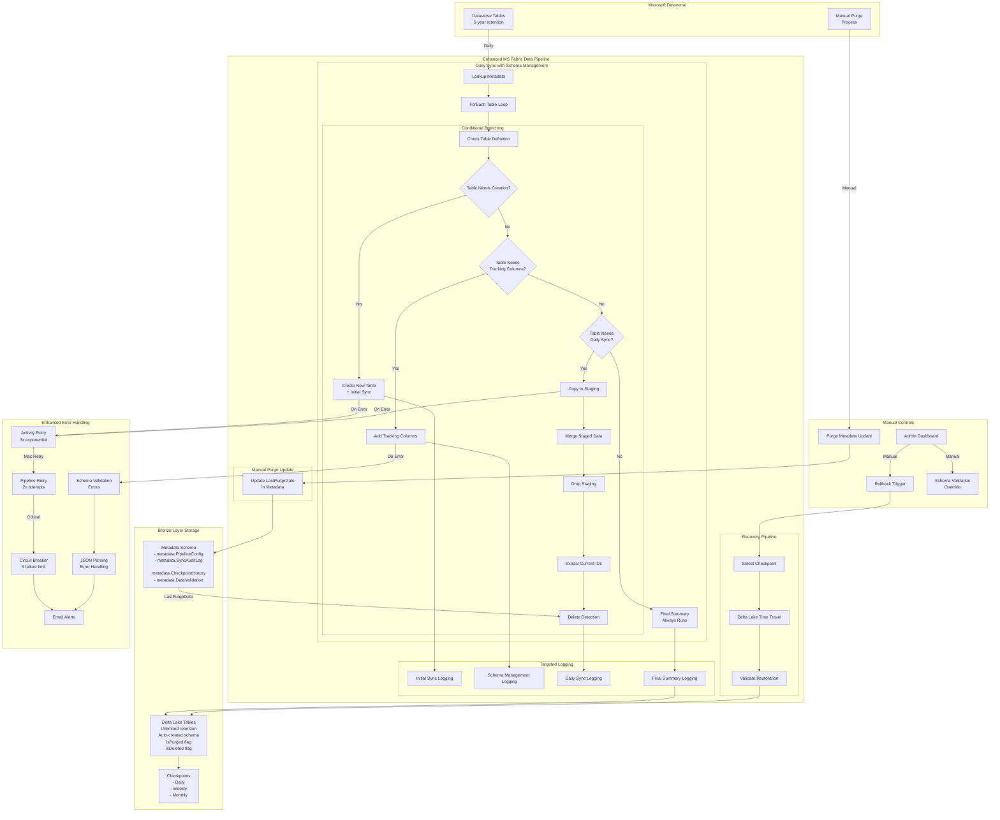

# Dataverse to MS Fabric Bronze Layer Synchronization
## Complete Project Documentation - Enhanced Version

---

# 1. Architecture Description

## Executive Summary

This architecture implements a robust data synchronization solution from Microsoft Dataverse to Microsoft Fabric Bronze Layer storage, designed to preserve complete historical data beyond Dataverse's 5-year retention limit while maintaining daily operational data currency. The enhanced version includes intelligent schema management and automated table creation capabilities.

## System Capabilities

### Core Functionality
- **Complete Data Synchronization**: Daily capture of all inserts, updates, and soft deletes from Dataverse
- **Intelligent Schema Management**: Automated table creation and tracking column addition with validation
- **Purge-Aware Detection**: Intelligent differentiation between data purges (age-based removal) and intentional deletions
- **Historical Data Preservation**: Permanent retention of all data in Bronze layer, even after Dataverse purges
- **Point-in-Time Recovery**: Delta Lake checkpoints enabling rapid rollback to any previous state
- **Automated Error Handling**: Multi-tier retry logic with exponential backoff and circuit breaker patterns
- **Manual Fallback Controls**: Administrator-triggered rollback to validated checkpoints
- **Race Condition Prevention**: Targeted logging approach eliminates parallel execution conflicts

### Data Retention Strategy
- **Dataverse**: 5 years + current year (system limitation with manual purges)
- **Fabric Bronze Layer**: Unlimited historical retention (includes purged records)
- **Checkpoint Retention**: Daily (7 days), Weekly (4 weeks), Monthly (12 months), Pre-purge (permanent)

## Technical Architecture

### Technology Stack
- **Source System**: Microsoft Dataverse
- **Target Platform**: Microsoft Fabric Lakehouse (Bronze Layer)
- **Storage Format**: Delta Lake tables with time travel capabilities
- **Integration Tools**: MS Fabric Data Pipelines, Copy Activities, Notebooks (Spark SQL)
- **Orchestration**: Metadata-driven ForEach loops with conditional branching
- **Schema Management**: Automated with validation and error handling

### Enhanced Data Flow Architecture

```
Dataverse → Enhanced Daily Sync Pipeline → Bronze Layer (Current State)
                          ↓
                Schema Validation & Management
                          ↓
                 Conditional Branching:
                 ├── New Table Creation
                 ├── Schema Enhancement  
                 └── Daily Synchronization
                          ↓
              Targeted Logging Architecture
                          ↓
           Query-Based State Reconstruction
                          ↓
            Comprehensive Validation & Summary
                          
Manual Purge in Dataverse → Update Metadata → Next Sync Handles Automatically
```

### Key Technical Decisions

| Decision | Choice | Rationale |
|----------|--------|-----------|
| Schema Management | Automated with conditional branching | Eliminates manual table creation, handles schema evolution |
| Logging Architecture | Targeted logging with reconstruction | Prevents race conditions in parallel ForEach execution |
| CDC Method | Copy Activity with Purge-Aware Detection | Simpler than Synapse Link, handles both deletes and purges |
| Storage Format | Delta Lake | ACID transactions, time travel, schema evolution |
| Purge Handling | Metadata-driven classification | No separate pipeline needed, automatic handling |
| Merge Strategy | Notebook (Spark SQL) preferred | Better control for complex logic and schema operations |
| Orchestration | Metadata-driven with conditional logic | Eliminates per-table manual configuration |
| Failure Strategy | Checkpoint-based rollback | Rapid recovery without data loss |

## Error Handling & Recovery

### Automated Error Handling
1. **Activity-Level Retry**: 3 attempts with exponential backoff (2, 4, 8 minutes)
2. **Pipeline-Level Retry**: 2 attempts for transient failures
3. **Circuit Breaker**: Prevents cascade failures after 5 consecutive errors
4. **Graceful Degradation**: Individual table failures don't stop entire pipeline
5. **JSON Parsing**: Robust parameter handling with specific error identification
6. **Schema Validation**: Prevents pipeline execution with invalid table definitions

### Manual Fallback Mechanism
1. **Checkpoint Selection**: Administrator selects from validated checkpoints
2. **Rollback Execution**: One-click restoration via parameterized pipeline
3. **Validation**: Automatic post-rollback data quality checks
4. **Audit Trail**: Complete logging of rollback operations

## Purge Management Strategy

### Purge vs Delete Differentiation
- **IsPurged = 1**: Records removed from Dataverse due to age (>5 years old)
  - Still valid for historical reporting
  - Not considered missing data
- **IsDeleted = 1**: Records intentionally deleted from Dataverse
  - Excluded from current reports
  - Represents actual data removal

### Purge Process Flow
1. Admin manually purges old data in Dataverse (annually)
2. Admin updates metadata.PipelineConfig.LastPurgeDate
3. Next daily sync automatically classifies missing records:
   - Old records (created before LastPurgeDate) → IsPurged = 1
   - Recent records (created after LastPurgeDate) → IsDeleted = 1

---

# 2. Enhanced Implementation Plan

## Project Phases

### Phase 1: Foundation Setup (Week 1)
**Objective**: Establish core infrastructure, metadata framework, and logging architecture

### Phase 2: Enhanced Schema Management (Weeks 2-3)
**Objective**: Implement intelligent table creation, schema validation, and conditional branching

### Phase 3: Core Synchronization with Targeted Logging (Week 4)
**Objective**: Complete sync pipeline with race condition prevention and state reconstruction

### Phase 4: Advanced Features & Recovery (Week 5)
**Objective**: Checkpoint, recovery, and comprehensive error handling systems

### Phase 5: Production Deployment (Week 6)
**Objective**: ACC/UAT testing and production release

## Enhanced Feature & User Story Breakdown

### Feature 1: Foundation Setup with Metadata Schema
**Estimated Effort**: 40 hours

**User Stories**:

| ID | Story | Estimate | Acceptance Criteria |
|----|-------|----------|-------------------|
| FS-001 | As a data engineer, I need metadata schema with comprehensive tracking | 12h | - metadata.PipelineConfig table created<br>- metadata.SyncAuditLog table created<br>- metadata.CheckpointHistory table created<br>- metadata.DataValidation table created |
| FS-002 | As a data engineer, I need Bronze layer table structure validation | 8h | - Schema validation logic implemented<br>- Error handling for missing tables<br>- Automated tracking column detection |
| FS-003 | As a data engineer, I need enhanced pipeline structure with conditional branching | 12h | - Pipeline created with conditional logic<br>- ForEach activity with branching<br>- Metadata connection tested |
| FS-004 | As a data engineer, I need targeted logging architecture framework | 8h | - Four specialized logging notebooks created<br>- Parameter passing validated<br>- Race condition prevention verified |

### Feature 2: Enhanced Schema Management
**Estimated Effort**: 64 hours

**User Stories**:

| ID | Story | Estimate | Acceptance Criteria |
|----|-------|----------|-------------------|
| SM-001 | As a data engineer, I need automated table existence validation | 8h | - Schema check notebook implemented<br>- Table definition validation logic<br>- Error reporting for manual creation needs |
| SM-002 | As a data engineer, I need automated new table creation with initial sync | 16h | - Copy Activity for table creation<br>- Combined table creation and initial sync<br>- Initial sync logging notebook |
| SM-003 | As a data engineer, I need automated tracking column management | 12h | - Conditional tracking column addition<br>- Index creation for performance<br>- Schema management logging |
| SM-004 | As a data engineer, I need robust parameter handling and JSON parsing | 8h | - Error-resistant JSON parsing<br>- Timezone-aware timestamp processing<br>- Consistent exitValue format |
| SM-005 | As a data engineer, I need comprehensive schema management testing | 20h | - All conditional branches tested<br>- New table creation validated<br>- Schema enhancement verified |

### Feature 3: Core Synchronization with Targeted Logging
**Estimated Effort**: 72 hours

**User Stories**:

| ID | Story | Estimate | Acceptance Criteria |
|----|-------|----------|-------------------|
| CS-001 | As a data engineer, I need staging-based synchronization approach | 16h | - Copy to staging table<br>- Merge staged data with upsert<br>- Staging table cleanup |
| CS-002 | As a data engineer, I need enhanced delete detection with logging | 12h | - Current ID extraction<br>- Purge-aware classification<br>- Delete detection logging |
| CS-003 | As a data engineer, I need daily sync logging notebook | 8h | - DataSync operation logging<br>- DeleteDetection operation logging<br>- Parameterized logging calls |
| CS-004 | As a data engineer, I need query-based state reconstruction | 16h | - Final summary notebook implementation<br>- Query logged operations<br>- State reconstruction from audit log |
| CS-005 | As a data engineer, I need comprehensive validation and summary | 12h | - Bronze layer data validation<br>- Internal consistency checks<br>- Checkpoint creation logic |
| CS-006 | As a data engineer, I need end-to-end pipeline testing | 8h | - Complete pipeline validation<br>- All execution paths tested<br>- Audit trail verification |

### Feature 4: Purge Management with Enhanced Logging
**Estimated Effort**: 32 hours

| ID | Story | Estimate | Acceptance Criteria |
|----|-------|----------|-------------------|
| PM-001 | As a data admin, I need enhanced purge metadata management | 20h | - Pipeline for updating LastPurgeDate<br>- Validation and confirmation<br>- Enhanced audit trail maintained |
| PM-002 | As a data analyst, I need purge-aware reporting with validation | 12h | - IsPurged flag properly set<br>- Historical data accessible<br>- Reports exclude deleted but include purged |

### Feature 5: Advanced Recovery with Comprehensive Monitoring
**Estimated Effort**: 56 hours

| ID | Story | Estimate | Acceptance Criteria |
|----|-------|----------|-------------------|
| CR-001 | As a system admin, I need automated checkpoint creation with validation | 16h | - Daily checkpoints created<br>- Retention policy applied<br>- CheckpointHistory updated |
| CR-002 | As a system admin, I need enhanced manual rollback capability | 24h | - Checkpoint selection pipeline<br>- Delta Lake time travel<br>- Comprehensive validation after rollback |
| CR-003 | As a data analyst, I need rollback validation with audit trail | 12h | - Pre/post rollback comparison<br>- Quality metrics verified<br>- Complete audit trail maintained |
| CR-004 | As a DevOps engineer, I need comprehensive monitoring and alerting | 4h | - Email on failures<br>- Daily health reports<br>- Performance dashboards |

### Feature 6: Scale Testing and Optimization
**Estimated Effort**: 40 hours

| ID | Story | Estimate | Acceptance Criteria |
|----|-------|----------|-------------------|
| SO-001 | As a data engineer, I need multi-table scale testing with schema management | 20h | - Performance with multiple tables<br>- Schema operations at scale<br>- Resource utilization verified |
| SO-002 | As a data engineer, I need performance optimization for enhanced pipeline | 12h | - Query optimization<br>- Index tuning<br>- Pipeline timing optimization |
| SO-003 | As a QA analyst, I need comprehensive integration testing | 8h | - All features tested together<br>- Load testing completed<br>- Performance benchmarks met |

### Feature 7: Production Deployment
**Estimated Effort**: 48 hours

| ID | Story | Estimate | Acceptance Criteria |
|----|-------|----------|-------------------|
| PD-001 | As a DevOps engineer, I need ACC environment setup with enhanced features | 16h | - Enhanced pipelines deployed to ACC<br>- Connections configured<br>- Security permissions set<br>- Test data scenarios ready |
| PD-002 | As a QA analyst, I need comprehensive UAT test scenarios | 12h | - Test cases executed for all features<br>- Defects logged and fixed<br>- Business sign-off obtained |
| PD-003 | As a DevOps engineer, I need production deployment | 8h | - Pipelines migrated<br>- Schedules activated<br>- Monitoring enabled |
| PD-004 | As a support analyst, I need enhanced operational documentation | 12h | - Comprehensive runbook created<br>- Troubleshooting guide<br>- Training completed<br>- Support processes defined |

## Enhanced Timeline & Milestones

```
Week 1: Enhanced Foundation Setup
├── Mon-Tue: Metadata schema with comprehensive tracking
├── Wed-Thu: Schema validation and conditional branching framework
└── Fri: Targeted logging architecture implementation

Week 2: Schema Management - Part 1
├── Mon-Tue: Table existence validation and automated creation
├── Wed-Thu: Tracking column management and parameter handling
└── Fri: Schema management testing and validation

Week 3: Schema Management - Part 2
├── Mon-Tue: Enhanced schema operations and error handling
├── Wed-Thu: Comprehensive testing of all schema scenarios
└── Fri: Integration with existing metadata framework

Week 4: Core Synchronization with Targeted Logging
├── Mon-Tue: Staging-based sync and targeted logging implementation
├── Wed-Thu: Query-based state reconstruction and validation
└── Fri: End-to-end pipeline testing and audit trail verification

Week 5: Advanced Features & Recovery
├── Mon-Tue: Enhanced purge management and checkpoint creation
├── Wed-Thu: Comprehensive monitoring and rollback capabilities
└── Fri: Scale testing and performance optimization

Week 6: Production Deployment
├── Mon-Tue: ACC environment with all enhanced features
├── Wed-Thu: Comprehensive UAT execution and issue resolution
└── Fri: Production deployment and operational handover
```

---

# 3. Enhanced System Architecture Diagram



---

# 4. Enhanced Pipeline Setup

## Enhanced Pipeline 1: Daily Sync with Schema Management

### Pipeline Summary
**Enhanced seven-activity approach with conditional branching and targeted logging**:

```
Activity 1: Lookup - Get Enabled Tables
   - Source: metadata.PipelineConfig
   - Returns: Array of tables with schema info
   - Includes: LastPurgeDate, schema requirements

Activity 2: ForEach - Process Tables with Conditional Logic
   Contains nested conditional activities per table:
   
   Activity 2.0: Notebook - Check Table Definition
      - Validates table existence
      - Analyzes schema requirements
      - Determines necessary actions
   
   Activity 2.1: If Condition - Table Needs to Be Created
      True Branch:
         - Copy Activity: Create New Table (includes initial sync)
         - Notebook: Initial Sync Logging
      False Branch: Skip
   
   Activity 2.2: If Condition - Table Needs Tracking Columns
      True Branch:
         - Notebook: Add Tracking Columns
         - Notebook: Schema Management Logging
      False Branch: Skip
   
   Activity 2.3: If Condition - Table Needs Daily Sync
      True Branch:
         - Copy Activity: Copy to Staging
         - Notebook: Merge Staged Data
         - Notebook: Drop Staging Table
         - Copy Activity: Extract Current IDs
         - Notebook: Purge-Aware Delete Detection
         - Notebook: Daily Sync Logging
      False Branch: Skip
   
   Activity 2.4: Notebook - Final Summary (ALWAYS RUNS)
      - Query all logged operations
      - Reconstruct execution state
      - Perform Bronze layer validation
      - Update metadata.PipelineConfig
      - Create checkpoint entries
      - Generate comprehensive summary
```

### Pipeline Parameters
```json
{
  "RunMode": "Daily",
  "MaxParallelTables": 5,
  "EnableCheckpoint": true,
  "SchemaValidationMode": "Strict"
}
```

### Detailed Activity Configuration

#### Activity 1: Lookup - Get Enabled Tables
**Type**: Lookup
**Source**: Notebook Activity
```sql
%%sql
SELECT 
    TableName, 
    PrimaryKeyColumn, 
    SchemaName,
    LastPurgeDate,
    PurgeRecordCount,
    TableExists,
    HasTrackingColumns,
    LastDailySync
FROM metadata.PipelineConfig
WHERE SyncEnabled = true
ORDER BY TableName
```
**Output**: Array of table configurations with enhanced metadata

#### Activity 2: ForEach - Process Tables
**Type**: ForEach
**Items**: `@activity('Get Enabled Tables').output.value`
**Batch Count**: 5
**Sequential**: False

**Inside ForEach Container:**

##### Activity 2.0: Notebook - Check Table Definition
**Type**: Notebook Activity
**Notebook**: CheckTableDefinition
**Parameters**:
```json
{
  "table_name": "@{item().TableName}",
  "schema_name": "@{item().SchemaName}",
  "pipeline_run_id": "@{pipeline().RunId}",
  "pipeline_trigger_time": "@{pipeline().TriggerTime}"
}
```

**Notebook Content**:
```python
# Parameters
table_name = "account"  # From pipeline parameter
schema_name = "dbo"     # From pipeline parameter
pipeline_run_id = "12345"
pipeline_trigger_time = "2024-01-15T10:00:00Z"

# Check if table exists in Bronze layer
table_exists = False
has_tracking_columns = False
needs_creation = False
needs_tracking_columns = False

try:
    # Check table existence
    result = spark.sql(f"SHOW TABLES LIKE '{table_name}'")
    table_exists = result.count() > 0
    
    if table_exists:
        # Check for tracking columns
        columns = spark.sql(f"DESCRIBE {table_name}").collect()
        column_names = [row.col_name for row in columns]
        
        required_columns = ['IsDeleted', 'IsPurged', 'DeletedDate', 'PurgedDate', 'LastSynced']
        has_tracking_columns = all(col in column_names for col in required_columns)
        needs_tracking_columns = not has_tracking_columns
    else:
        needs_creation = True
        
    # Log schema check operation
    spark.sql(f"""
        INSERT INTO metadata.SyncAuditLog (
            LogId, PipelineRunId, PipelineName, TableName, Operation,
            StartTime, EndTime, Status, Notes
        ) VALUES (
            '{pipeline_run_id}_{table_name}_schema_check',
            '{pipeline_run_id}',
            'DailySync',
            '{table_name}',
            'SchemaCheck',
            '{pipeline_trigger_time}',
            current_timestamp(),
            'Success',
            'Table exists: {table_exists}, Has tracking: {has_tracking_columns}'
        )
    """)
    
    # Set exit values for conditional activities
    exit_value = {
        "table_exists": table_exists,
        "has_tracking_columns": has_tracking_columns,
        "needs_creation": needs_creation,
        "needs_tracking_columns": needs_tracking_columns,
        "schema_check_status": "Success"
    }
    
    print(f"Schema check completed: {exit_value}")

except Exception as e:
    # Log error
    spark.sql(f"""
        INSERT INTO metadata.SyncAuditLog (
            LogId, PipelineRunId, PipelineName, TableName, Operation,
            StartTime, EndTime, Status, ErrorMessage
        ) VALUES (
            '{pipeline_run_id}_{table_name}_schema_error',
            '{pipeline_run_id}',
            'DailySync',
            '{table_name}',
            'SchemaCheck',
            '{pipeline_trigger_time}',
            current_timestamp(),
            'Failed',
            '{str(e)}'
        )
    """)
    
    exit_value = {
        "schema_check_status": "Failed",
        "error_message": str(e)
    }
    
    raise Exception(f"Schema check failed: {str(e)}")

# Return exit value for pipeline consumption
mssparkutils.notebook.exit(exit_value)
```

##### Activity 2.1: If Condition - Table Needs to Be Created
**Type**: If Condition
**Expression**: `@equals(json(activity('Check Table Definition').output.result.exitValue).needs_creation, true)`

**True Branch:**

###### Activity 2.1.1: Copy Activity - Create New Table
**Type**: Copy Activity
**Source**: 
- Dataset: Dataverse
- Query: `SELECT * FROM @{item().SchemaName}.@{item().TableName} WHERE ModifiedOn >= DATEADD(day, -7, GETDATE())`
**Sink**:
- Dataset: Lakehouse
- Table: `staging_@{item().TableName}`
- Write Method: Overwrite

###### Activity 2.3.2: Notebook - Merge Staged Data
**Type**: Notebook Activity

**Notebook Content**:
```python
# Merge staged data into target table
table_name = "account"
primary_key = "accountid"
staging_table = f"staging_{table_name}"
pipeline_run_id = "12345"

try:
    # Perform merge operation (upsert)
    merge_sql = f"""
        MERGE INTO {table_name} AS target
        USING {staging_table} AS source
        ON target.{primary_key} = source.{primary_key}
        WHEN MATCHED THEN UPDATE SET *
        WHEN NOT MATCHED THEN INSERT *
    """
    
    spark.sql(merge_sql)
    
    # Get merge statistics
    merge_stats = spark.sql(f"""
        SELECT 
            COUNT(*) as total_staged_records
        FROM {staging_table}
    """).collect()[0]
    
    exit_value = {
        "operation_status": "Success",
        "records_processed": merge_stats.total_staged_records
    }

except Exception as e:
    exit_value = {
        "operation_status": "Failed",
        "error_message": str(e)
    }
    raise Exception(f"Merge operation failed: {str(e)}")

mssparkutils.notebook.exit(exit_value)
```

###### Activity 2.3.3: Notebook - Drop Staging Table
**Type**: Notebook Activity

**Notebook Content**:
```python
# Clean up staging table
table_name = "account"
staging_table = f"staging_{table_name}"

try:
    spark.sql(f"DROP TABLE IF EXISTS {staging_table}")
    
    exit_value = {"cleanup_status": "Success"}

except Exception as e:
    exit_value = {"cleanup_status": "Failed", "error_message": str(e)}
    # Don't raise exception for cleanup failures
    print(f"Warning: Staging table cleanup failed: {str(e)}")

mssparkutils.notebook.exit(exit_value)
```

###### Activity 2.3.4: Copy Activity - Extract Current IDs
**Type**: Copy Activity
**Source**:
- Dataset: Dataverse  
- Query: `SELECT @{item().PrimaryKeyColumn} FROM @{item().SchemaName}.@{item().TableName}`
**Sink**:
- Dataset: Lakehouse
- Table: `temp_current_ids_@{item().TableName}`
- Write Method: Overwrite

###### Activity 2.3.5: Notebook - Purge-Aware Delete Detection
**Type**: Notebook Activity

**Notebook Content**:
```python
# Purge-aware delete detection
table_name = "account"
primary_key = "accountid"
temp_ids_table = f"temp_current_ids_{table_name}"
last_purge_date = "2024-01-01"  # From pipeline parameter
pipeline_run_id = "12345"

try:
    # Update records based on their status
    update_sql = f"""
        UPDATE {table_name}
        SET 
            IsDeleted = CASE 
                WHEN {primary_key} NOT IN (
                    SELECT {primary_key} FROM {temp_ids_table}
                )
                AND (CreatedDate >= COALESCE(CAST('{last_purge_date}' AS TIMESTAMP), CAST('1900-01-01' AS TIMESTAMP)))
                THEN true
                ELSE IsDeleted
            END,
            IsPurged = CASE
                WHEN {primary_key} NOT IN (
                    SELECT {primary_key} FROM {temp_ids_table}
                )
                AND '{last_purge_date}' IS NOT NULL
                AND CreatedDate < CAST('{last_purge_date}' AS TIMESTAMP)
                AND COALESCE(IsPurged, false) = false
                THEN true
                ELSE IsPurged
            END,
            DeletedDate = CASE
                WHEN IsDeleted = false AND {primary_key} NOT IN (
                    SELECT {primary_key} FROM {temp_ids_table}
                )
                AND (CreatedDate >= COALESCE(CAST('{last_purge_date}' AS TIMESTAMP), CAST('1900-01-01' AS TIMESTAMP)))
                THEN current_timestamp()
                ELSE DeletedDate
            END,
            PurgedDate = CASE
                WHEN IsPurged = false AND {primary_key} NOT IN (
                    SELECT {primary_key} FROM {temp_ids_table}
                )
                AND '{last_purge_date}' IS NOT NULL
                AND CreatedDate < CAST('{last_purge_date}' AS TIMESTAMP)
                THEN current_timestamp()
                ELSE PurgedDate
            END,
            LastSynced = current_timestamp()
        WHERE {primary_key} NOT IN (
            SELECT {primary_key} FROM {temp_ids_table}
        )
        AND (COALESCE(IsDeleted, false) = false OR COALESCE(IsPurged, false) = false)
    """
    
    spark.sql(update_sql)
    
    # Get update statistics
    stats = spark.sql(f"""
        SELECT 
            SUM(CASE WHEN IsDeleted = true THEN 1 ELSE 0 END) as deleted_count,
            SUM(CASE WHEN IsPurged = true THEN 1 ELSE 0 END) as purged_count
        FROM {table_name}
        WHERE LastSynced >= current_timestamp() - INTERVAL 1 MINUTE
    """).collect()[0]
    
    # Clean up temp table
    spark.sql(f"DROP TABLE IF EXISTS {temp_ids_table}")
    
    exit_value = {
        "operation_status": "Success",
        "deleted_records": stats.deleted_count or 0,
        "purged_records": stats.purged_count or 0
    }

except Exception as e:
    exit_value = {
        "operation_status": "Failed",
        "error_message": str(e)
    }
    raise Exception(f"Delete detection failed: {str(e)}")

mssparkutils.notebook.exit(exit_value)
```

###### Activity 2.3.6: Notebook - Daily Sync Logging
**Type**: Notebook Activity

**Notebook Content**:
```python
# Log daily sync operations
table_name = "account"
pipeline_run_id = "12345"
pipeline_trigger_time = "2024-01-15T10:00:00Z"
upsert_result = safe_json_parse('{"records_processed": 1000}', "upsert_result")
delete_detection_result = safe_json_parse('{"deleted_records": 5, "purged_records": 0}', "delete_detection_result")

try:
    # Log data sync operation
    spark.sql(f"""
        INSERT INTO metadata.SyncAuditLog (
            LogId, PipelineRunId, PipelineName, TableName, Operation,
            StartTime, EndTime, RowsProcessed, Status
        ) VALUES (
            '{pipeline_run_id}_{table_name}_data_sync',
            '{pipeline_run_id}',
            'DailySync',
            '{table_name}',
            'DataSync',
            '{pipeline_trigger_time}',
            current_timestamp(),
            {upsert_result.get('records_processed', 0)},
            'Success'
        )
    """)
    
    # Log delete detection operation
    spark.sql(f"""
        INSERT INTO metadata.SyncAuditLog (
            LogId, PipelineRunId, PipelineName, TableName, Operation,
            StartTime, EndTime, RowsDeleted, RowsPurged, Status
        ) VALUES (
            '{pipeline_run_id}_{table_name}_delete_detection',
            '{pipeline_run_id}',
            'DailySync',
            '{table_name}',
            'DeleteDetection',
            '{pipeline_trigger_time}',
            current_timestamp(),
            {delete_detection_result.get('deleted_records', 0)},
            {delete_detection_result.get('purged_records', 0)},
            'Success'
        )
    """)
    
    exit_value = {"logging_status": "Success"}

except Exception as e:
    exit_value = {"logging_status": "Failed", "error_message": str(e)}
    raise Exception(f"Daily sync logging failed: {str(e)}")

mssparkutils.notebook.exit(exit_value)
```

##### Activity 2.4: Notebook - Final Summary (Always Executes)
**Type**: Notebook Activity

**Notebook Content**:
```python
# Final summary with query-based reconstruction
table_name = "account"
schema_name = "dbo"
pipeline_run_id = "12345"
pipeline_trigger_time = "2024-01-15T10:00:00Z"

try:
    # Query all logged operations for this table and pipeline run
    logged_operations = spark.sql(f"""
        SELECT Operation, Status, RowsProcessed, RowsDeleted, RowsPurged, Notes
        FROM metadata.SyncAuditLog
        WHERE PipelineRunId = '{pipeline_run_id}'
        AND TableName = '{table_name}'
        ORDER BY StartTime
    """).collect()
    
    # Reconstruct execution state
    operations_summary = {}
    total_rows_processed = 0
    total_rows_deleted = 0
    total_rows_purged = 0
    overall_status = "Success"
    
    for op in logged_operations:
        operations_summary[op.Operation] = op.Status
        if op.RowsProcessed:
            total_rows_processed += op.RowsProcessed
        if op.RowsDeleted:
            total_rows_deleted += op.RowsDeleted
        if op.RowsPurged:
            total_rows_purged += op.RowsPurged
        if op.Status == "Failed":
            overall_status = "Failed"
    
    # Perform Bronze layer data validation
    validation_result = spark.sql(f"""
        SELECT 
            COUNT(*) as total_records,
            SUM(CASE WHEN IsDeleted = false AND IsPurged = false THEN 1 ELSE 0 END) as active_records,
            SUM(CASE WHEN IsDeleted = true THEN 1 ELSE 0 END) as deleted_records,
            SUM(CASE WHEN IsPurged = true THEN 1 ELSE 0 END) as purged_records
        FROM {table_name}
    """).collect()[0]
    
    # Validate internal consistency
    validation_passed = (
        validation_result.total_records == 
        validation_result.active_records + validation_result.deleted_records + validation_result.purged_records
    )
    
    # Insert validation record
    spark.sql(f"""
        INSERT INTO metadata.DataValidation (
            ValidationId, ValidationDate, TableName, BronzeRowCount,
            ActiveRowCount, DeletedRowCount, PurgedRowCount, ValidationPassed, Notes
        ) VALUES (
            '{pipeline_run_id}_{table_name}_validation',
            current_timestamp(),
            '{table_name}',
            {validation_result.total_records},
            {validation_result.active_records},
            {validation_result.deleted_records},
            {validation_result.purged_records},
            {validation_passed},
            'Query-based reconstruction validation'
        )
    """)
    
    # Update PipelineConfig if sync was successful
    if overall_status == "Success" and "DataSync" in operations_summary:
        spark.sql(f"""
            UPDATE metadata.PipelineConfig
            SET LastDailySync = current_timestamp()
            WHERE TableName = '{table_name}'
        """)
    
    # Create checkpoint entry for successful operations
    if overall_status == "Success":
        spark.sql(f"""
            INSERT INTO metadata.CheckpointHistory (
                CheckpointId, CheckpointName, CheckpointType, CreatedDate,
                TablesIncluded, TotalRows, ValidationStatus, RetentionDate, IsActive
            ) VALUES (
                '{pipeline_run_id}_{table_name}_checkpoint',
                'daily_{table_name}_' + date_format(current_timestamp(), 'yyyyMMdd_HHmmss'),
                'Daily',
                current_timestamp(),
                1,
                {validation_result.total_records},
                '{validation_passed}',
                current_date() + INTERVAL 7 DAYS,
                true
            )
        """)
    
    # Generate comprehensive summary
    summary = {
        "table_name": table_name,
        "pipeline_run_id": pipeline_run_id,
        "overall_status": overall_status,
        "operations_executed": list(operations_summary.keys()),
        "total_rows_processed": total_rows_processed,
        "total_rows_deleted": total_rows_deleted,
        "total_rows_purged": total_rows_purged,
        "bronze_layer_validation": {
            "total_records": validation_result.total_records,
            "active_records": validation_result.active_records,
            "deleted_records": validation_result.deleted_records,
            "purged_records": validation_result.purged_records,
            "validation_passed": validation_passed
        }
    }
    
    print(f"Final Summary for {table_name}: {summary}")
    
    exit_value = summary

except Exception as e:
    # Log final summary error
    spark.sql(f"""
        INSERT INTO metadata.SyncAuditLog (
            LogId, PipelineRunId, PipelineName, TableName, Operation,
            StartTime, EndTime, Status, ErrorMessage
        ) VALUES (
            '{pipeline_run_id}_{table_name}_final_summary_error',
            '{pipeline_run_id}',
            'DailySync',
            '{table_name}',
            'FinalSummary',
            '{pipeline_trigger_time}',
            current_timestamp(),
            'Failed',
            '{str(e)}'
        )
    """)
    
    exit_value = {
        "table_name": table_name,
        "overall_status": "Failed",
        "error_message": str(e)
    }
    
    print(f"Final Summary Error for {table_name}: {str(e)}")

mssparkutils.notebook.exit(exit_value)
```

### Error Handling Configuration

#### Pipeline-Level Error Handler
**Type**: Until Activity (configured as error handler)
**Inside Error Handler:**

##### Activity E1: Notebook - Log Pipeline Error
**Type**: Notebook Activity
```python
# Log pipeline-level errors
pipeline_run_id = "12345"
error_message = "Pipeline failed"

try:
    spark.sql(f"""
        INSERT INTO metadata.SyncAuditLog (
            LogId, PipelineRunId, PipelineName, Status, ErrorMessage, StartTime, EndTime
        ) VALUES (
            '{pipeline_run_id}_pipeline_error',
            '{pipeline_run_id}',
            'DailySync',
            'Failed',
            '{error_message}',
            current_timestamp(),
            current_timestamp()
        )
    """)
except:
    print("Failed to log pipeline error")
```

##### Activity E2: Web - Send Alert Email
**Type**: Web Activity
**Method**: POST
**URL**: `https://prod-xx.westeurope.logic.azure.com/workflows/email-alert`
**Body**:
```json
{
  "to": "dataops-team@company.com",
  "subject": "Enhanced Daily Sync Pipeline Failure",
  "body": "Enhanced pipeline @{pipeline().RunId} failed at @{utcnow()}. Check metadata.SyncAuditLog for detailed error information.",
  "priority": "high"
}
```

## Pipeline 2: Enhanced Purge Metadata Update

### Pipeline Summary
**Enhanced three-activity approach with comprehensive validation**:

```
Activity 1: Notebook - Validate Purge Parameters
   - Validates table existence and purge date
   - Estimates records to be affected
   - Generates purge impact report

Activity 2: Notebook - Update Purge Metadata
   - Updates LastPurgeDate for specified tables
   - Records purge event in audit log
   - Creates pre-purge checkpoint

Activity 3: Web - Send Confirmation with Impact Report
   - Notifies team of purge metadata update
   - Includes estimated impact and validation results
   - Confirms next sync will handle purged records
```

### Pipeline Parameters
```json
{
  "TableNames": ["Table1", "Table2"],
  "PurgeDate": "@{utcnow()}",
  "EstimatedPurgedRecords": 0,
  "CreatePrePurgeCheckpoint": true
}
```

### Activity Configuration

#### Activity 1: Notebook - Validate Purge Parameters
**Type**: Notebook Activity
```python
# Validate purge parameters and estimate impact
table_names = ["account", "donation"]
purge_date = "2024-01-01"
pipeline_run_id = "12345"

try:
    impact_report = {}
    
    for table_name in table_names:
        # Validate table exists in Bronze layer
        table_exists = spark.sql(f"SHOW TABLES LIKE '{table_name}'").count() > 0
        
        if not table_exists:
            raise Exception(f"Table {table_name} not found in Bronze layer")
        
        # Estimate records that would be marked as purged
        estimated_purged = spark.sql(f"""
            SELECT COUNT(*) as count
            FROM {table_name}
            WHERE CreatedDate < CAST('{purge_date}' AS TIMESTAMP)
            AND COALESCE(IsPurged, false) = false
            AND COALESCE(IsDeleted, false) = false
        """).collect()[0].count
        
        impact_report[table_name] = {
            "estimated_purged_records": estimated_purged,
            "table_validated": True
        }
    
    # Log validation
    spark.sql(f"""
        INSERT INTO metadata.SyncAuditLog (
            LogId, PipelineRunId, PipelineName, Operation, Status, Notes
        ) VALUES (
            '{pipeline_run_id}_purge_validation',
            '{pipeline_run_id}',
            'PurgeMetadataUpdate',
            'PurgeValidation',
            'Success',
            'Impact report: {str(impact_report)}'
        )
    """)
    
    exit_value = {
        "validation_status": "Success",
        "impact_report": impact_report
    }

except Exception as e:
    exit_value = {
        "validation_status": "Failed",
        "error_message": str(e)
    }
    raise Exception(f"Purge validation failed: {str(e)}")

mssparkutils.notebook.exit(exit_value)
```

#### Activity 2: Notebook - Update Purge Metadata
**Type**: Notebook Activity
```python
# Update purge metadata with comprehensive logging
table_names = ["account", "donation"]
purge_date = "2024-01-01"
pipeline_run_id = "12345"
validation_result = safe_json_parse('{"validation_status": "Success"}', "validation_result")

try:
    # Create pre-purge checkpoint if requested
    checkpoint_name = f"pre_purge_{purge_date.replace('-', '')}"
    
    spark.sql(f"""
        INSERT INTO metadata.CheckpointHistory (
            CheckpointId, CheckpointName, CheckpointType, CreatedDate,
            TablesIncluded, ValidationStatus, RetentionDate, IsActive
        ) VALUES (
            '{pipeline_run_id}_pre_purge_checkpoint',
            '{checkpoint_name}',
            'PrePurge',
            current_timestamp(),
            {len(table_names)},
            'Validated',
            current_date() + INTERVAL 365 DAYS,
            true
        )
    """)
    
    # Update purge metadata for specified tables
    for table_name in table_names:
        spark.sql(f"""
            UPDATE metadata.PipelineConfig
            SET 
                LastPurgeDate = CAST('{purge_date}' AS TIMESTAMP),
                ModifiedDate = current_timestamp()
            WHERE TableName = '{table_name}'
        """)
        
        # Log purge event for each table
        spark.sql(f"""
            INSERT INTO metadata.SyncAuditLog (
                LogId, PipelineRunId, PipelineName, TableName, Operation,
                StartTime, EndTime, Status, Notes
            ) VALUES (
                '{pipeline_run_id}_{table_name}_purge_recorded',
                '{pipeline_run_id}',
                'PurgeMetadataUpdate',
                '{table_name}',
                'PurgeRecorded',
                current_timestamp(),
                current_timestamp(),
                'Success',
                'Purge date recorded. Next sync will classify accordingly.'
            )
        """)
    
    exit_value = {
        "update_status": "Success",
        "checkpoint_created": checkpoint_name,
        "tables_updated": table_names
    }

except Exception as e:
    exit_value = {
        "update_status": "Failed",
        "error_message": str(e)
    }
    raise Exception(f"Purge metadata update failed: {str(e)}")

mssparkutils.notebook.exit(exit_value)
```

#### Activity 3: Web - Send Confirmation with Impact Report
**Type**: Web Activity
**Method**: POST
**URL**: `https://prod-xx.westeurope.logic.azure.com/workflows/email-alert`
**Body**:
```json
{
  "to": "dataops-team@company.com",
  "subject": "Purge Metadata Updated - Impact Report",
  "body": "Purge metadata has been updated for @{pipeline().parameters.TableNames}. Pre-purge checkpoint created: @{json(activity('Update Purge Metadata').output.result.exitValue).checkpoint_created}. Next daily sync will properly classify purged records. Check metadata.SyncAuditLog for detailed impact analysis.",
  "priority": "normal"
}
```

## Pipeline 3: Enhanced Manual Rollback Pipeline

### Pipeline Summary
**Enhanced four-activity approach with comprehensive validation**:

```
Activity 1: Notebook - Validate Checkpoint and Generate Impact Report
   - Verifies checkpoint exists and is valid
   - Analyzes current vs checkpoint state differences
   - Generates detailed rollback impact report

Activity 2: If Condition - Checkpoint Valid and Approved
   True Branch:
   
   Activity 2.1: Notebook - Execute Rollback with Validation
      - Performs Delta Lake time travel for all affected tables
      - Validates each table restoration
      - Creates post-rollback validation records
   
   Activity 2.2: Notebook - Post-Rollback Comprehensive Summary
      - Validates data integrity after rollback
      - Updates configuration and audit records
      - Generates complete rollback report

   False Branch:
   - Send error notification with specific validation failures
```

### Pipeline Parameters
```json
{
  "CheckpointName": "",
  "TablesScope": "All",
  "ValidateAfterRollback": true,
  "RequireApproval": true
}
```

### Activity Configuration

#### Activity 1: Notebook - Validate Checkpoint and Generate Impact Report
**Type**: Notebook Activity
```python
# Comprehensive checkpoint validation and impact analysis
checkpoint_name = "pre_purge_20240101"
pipeline_run_id = "12345"

try:
    # Validate checkpoint exists and is active
    checkpoint_info = spark.sql(f"""
        SELECT CheckpointName, CreatedDate, TablesIncluded, CheckpointType, ValidationStatus
        FROM metadata.CheckpointHistory
        WHERE CheckpointName = '{checkpoint_name}'
        AND IsActive = true
    """).collect()
    
    if not checkpoint_info:
        raise Exception(f"Checkpoint '{checkpoint_name}' not found or inactive")
    
    checkpoint = checkpoint_info[0]
    
    # Get affected tables
    affected_tables = spark.sql(f"""
        SELECT DISTINCT TableName
        FROM metadata.PipelineConfig
        WHERE SyncEnabled = true
    """).collect()
    
    # Generate impact report for each table
    impact_report = {}
    for table_row in affected_tables:
        table_name = table_row.TableName
        
        try:
            current_stats = spark.sql(f"""
                SELECT 
                    COUNT(*) as total_records,
                    SUM(CASE WHEN IsDeleted = false AND IsPurged = false THEN 1 ELSE 0 END) as active_records,
                    SUM(CASE WHEN IsDeleted = true THEN 1 ELSE 0 END) as deleted_records,
                    SUM(CASE WHEN IsPurged = true THEN 1 ELSE 0 END) as purged_records,
                    MAX(LastSynced) as last_sync_time
                FROM {table_name}
            """).collect()[0]
            
            impact_report[table_name] = {
                "current_total_records": current_stats.total_records,
                "current_active_records": current_stats.active_records,
                "current_deleted_records": current_stats.deleted_records,
                "current_purged_records": current_stats.purged_records,
                "last_sync_time": str(current_stats.last_sync_time),
                "rollback_feasible": True
            }
        except Exception as table_error:
            impact_report[table_name] = {
                "rollback_feasible": False,
                "error": str(table_error)
            }
    
    # Log validation results
    spark.sql(f"""
        INSERT INTO metadata.SyncAuditLog (
            LogId, PipelineRunId, PipelineName, Operation, Status, Notes
        ) VALUES (
            '{pipeline_run_id}_rollback_validation',
            '{pipeline_run_id}',
            'ManualRollback',
            'RollbackValidation',
            'Success',
            'Checkpoint validated. Impact report generated.'
        )
    """)
    
    exit_value = {
        "validation_status": "Success",
        "checkpoint_info": {
            "name": checkpoint.CheckpointName,
            "created_date": str(checkpoint.CreatedDate),
            "tables_included": checkpoint.TablesIncluded,
            "checkpoint_type": checkpoint.CheckpointType
        },
        "impact_report": impact_report,
        "rollback_approved": True  # In real implementation, this could require manual approval
    }

except Exception as e:
    exit_value = {
        "validation_status": "Failed",
        "error_message": str(e),
        "rollback_approved": False
    }
    
    # Log validation failure
    spark.sql(f"""
        INSERT INTO metadata.SyncAuditLog (
            LogId, PipelineRunId, PipelineName, Operation, Status, ErrorMessage
        ) VALUES (
            '{pipeline_run_id}_rollback_validation_failed',
            '{pipeline_run_id}',
            'ManualRollback',
            'RollbackValidation',
            'Failed',
            '{str(e)}'
        )
    """)

mssparkutils.notebook.exit(exit_value)
```

#### Activity 2: If Condition - Checkpoint Valid and Approved
**Type**: If Condition
**Expression**: `@and(equals(json(activity('Validate Checkpoint').output.result.exitValue).validation_status, 'Success'), equals(json(activity('Validate Checkpoint').output.result.exitValue).rollback_approved, true))`

**True Branch:**

##### Activity 2.1: Notebook - Execute Rollback with Validation
**Type**: Notebook Activity
```python
# Execute comprehensive rollback with validation
checkpoint_name = "pre_purge_20240101"
pipeline_run_id = "12345"
validation_result = safe_json_parse('{"validation_status": "Success"}', "validation_result")

try:
    # Get list of tables to rollback
    tables_to_rollback = spark.sql(f"""
        SELECT TableName FROM metadata.PipelineConfig
        WHERE SyncEnabled = true
    """).collect()
    
    rollback_results = {}
    
    for table_row in tables_to_rollback:
        table_name = table_row.TableName
        
        try:
            # Get table stats before rollback
            pre_rollback_stats = spark.sql(f"""
                SELECT COUNT(*) as record_count
                FROM {table_name}
            """).collect()[0]
            
            # Execute Delta Lake time travel to restore table
            # Note: This is pseudo-code, actual implementation depends on Delta Lake version support
            spark.sql(f"""
                RESTORE TABLE {table_name}
                TO VERSION AS OF '{checkpoint_name}'
            """)
            
            # Get table stats after rollback
            post_rollback_stats = spark.sql(f"""
                SELECT 
                    COUNT(*) as total_records,
                    SUM(CASE WHEN IsDeleted = false AND IsPurged = false THEN 1 ELSE 0 END) as active_records,
                    SUM(CASE WHEN IsDeleted = true THEN 1 ELSE 0 END) as deleted_records,
                    SUM(CASE WHEN IsPurged = true THEN 1 ELSE 0 END) as purged_records
                FROM {table_name}
            """).collect()[0]
            
            # Log restoration for this table
            spark.sql(f"""
                INSERT INTO metadata.SyncAuditLog (
                    LogId, PipelineRunId, PipelineName, TableName, Operation,
                    StartTime, EndTime, RowsProcessed, Status, Notes
                ) VALUES (
                    '{pipeline_run_id}_{table_name}_restore',
                    '{pipeline_run_id}',
                    'ManualRollback',
                    '{table_name}',
                    'Restore',
                    current_timestamp(),
                    current_timestamp(),
                    {post_rollback_stats.total_records},
                    'Success',
                    'Restored to checkpoint: {checkpoint_name}'
                )
            """)
            
            rollback_results[table_name] = {
                "status": "Failed",
                "error_message": str(table_error)
            }
    
    exit_value = {
        "rollback_status": "Success",
        "rollback_results": rollback_results
    }

except Exception as e:
    exit_value = {
        "rollback_status": "Failed",
        "error_message": str(e)
    }
    raise Exception(f"Rollback execution failed: {str(e)}")

mssparkutils.notebook.exit(exit_value)
```

##### Activity 2.2: Notebook - Post-Rollback Comprehensive Summary
**Type**: Notebook Activity
```python
# Comprehensive post-rollback validation and summary
checkpoint_name = "pre_purge_20240101"
pipeline_run_id = "12345"
rollback_result = safe_json_parse('{"rollback_status": "Success"}', "rollback_result")

try:
    # Query all rollback operations for comprehensive validation
    rollback_operations = spark.sql(f"""
        SELECT TableName, Operation, Status, RowsProcessed, ErrorMessage
        FROM metadata.SyncAuditLog
        WHERE PipelineRunId = '{pipeline_run_id}'
        AND Operation = 'Restore'
        ORDER BY StartTime
    """).collect()
    
    # Generate comprehensive validation report
    validation_summary = {
        "total_tables_processed": len(rollback_operations),
        "successful_rollbacks": sum(1 for op in rollback_operations if op.Status == "Success"),
        "failed_rollbacks": sum(1 for op in rollback_operations if op.Status == "Failed"),
        "total_records_restored": sum(op.RowsProcessed or 0 for op in rollback_operations if op.Status == "Success")
    }
    
    # Perform comprehensive data validation for each successfully rolled back table
    for op in rollback_operations:
        if op.Status == "Success":
            table_name = op.TableName
            
            validation_stats = spark.sql(f"""
                SELECT 
                    COUNT(*) as total_records,
                    SUM(CASE WHEN IsDeleted = false AND IsPurged = false THEN 1 ELSE 0 END) as active_records,
                    SUM(CASE WHEN IsDeleted = true THEN 1 ELSE 0 END) as deleted_records,
                    SUM(CASE WHEN IsPurged = true THEN 1 ELSE 0 END) as purged_records
                FROM {table_name}
            """).collect()[0]
            
            # Validate internal consistency
            validation_passed = (
                validation_stats.total_records == 
                validation_stats.active_records + validation_stats.deleted_records + validation_stats.purged_records
            )
            
            # Insert post-rollback validation record
            spark.sql(f"""
                INSERT INTO metadata.DataValidation (
                    ValidationId, ValidationDate, TableName, BronzeRowCount,
                    ActiveRowCount, DeletedRowCount, PurgedRowCount, ValidationPassed, Notes
                ) VALUES (
                    '{pipeline_run_id}_{table_name}_post_rollback_validation',
                    current_timestamp(),
                    '{table_name}',
                    {validation_stats.total_records},
                    {validation_stats.active_records},
                    {validation_stats.deleted_records},
                    {validation_stats.purged_records},
                    {validation_passed},
                    'Post-rollback validation for checkpoint: {checkpoint_name}'
                )
            """)
    
    # Update checkpoint history to mark rollback completion
    spark.sql(f"""
        UPDATE metadata.CheckpointHistory
        SET Notes = CONCAT(
            COALESCE(Notes, ''), 
            '; Rollback completed: ', 
            current_timestamp(),
            '; Tables restored: ',
            {validation_summary['successful_rollbacks']}
        )
        WHERE CheckpointName = '{checkpoint_name}'
    """)
    
    # Create rollback completion audit record
    spark.sql(f"""
        INSERT INTO metadata.SyncAuditLog (
            LogId, PipelineRunId, PipelineName, Operation, Status, Notes
        ) VALUES (
            '{pipeline_run_id}_rollback_completed',
            '{pipeline_run_id}',
            'ManualRollback',
            'RollbackCompleted',
            'Success',
            'Comprehensive rollback completed. {validation_summary[''successful_rollbacks'']} tables restored successfully.'
        )
    """)
    
    exit_value = {
        "summary_status": "Success",
        "validation_summary": validation_summary,
        "checkpoint_name": checkpoint_name
    }

except Exception as e:
    exit_value = {
        "summary_status": "Failed",
        "error_message": str(e)
    }
    raise Exception(f"Post-rollback summary failed: {str(e)}")

mssparkutils.notebook.exit(exit_value)
```

**False Branch:**

##### Activity 2.3: Web - Send Rollback Failure Notification
**Type**: Web Activity
**Method**: POST
**URL**: `https://prod-xx.westeurope.logic.azure.com/workflows/email-alert`
**Body**:
```json
{
  "to": "dataops-team@company.com",
  "subject": "Rollback Validation Failed",
  "body": "Rollback validation failed for checkpoint @{pipeline().parameters.CheckpointName}. Error: @{json(activity('Validate Checkpoint').output.result.exitValue).error_message}. Check metadata.SyncAuditLog for detailed validation failures.",
  "priority": "high"
}
```

---

# 5. Enhanced Metadata Tables Architecture

## Complete Enhanced Metadata Schema

### Purpose and Lifecycle

| Table | Purpose | Created When | Maintained By | Consumed By |
|-------|---------|--------------|---------------|-------------|
| **metadata.PipelineConfig** | Master control with enhanced schema tracking | Project setup | Manual updates + schema management | All pipelines via Lookup activity |
| **metadata.SyncAuditLog** | Comprehensive execution history with operation details | First pipeline run | Automatic by all notebooks | Monitoring dashboards, troubleshooting, reconstruction |
| **metadata.CheckpointHistory** | Enhanced rollback point management | First checkpoint | Automatic after operations | Rollback pipeline, retention cleanup |
| **metadata.DataValidation** | Comprehensive data quality tracking | First validation run | Final summary notebook | Quality monitoring, alerts |

## Enhanced Metadata Table Creation

### Setup Requirements
1. **Create a Notebook** in your MS Fabric workspace called "CreateEnhancedMetadata"
2. **Attach your Lakehouse** to the notebook
3. **Execute the Spark SQL commands** below to create enhanced metadata tables

### Enhanced Metadata Creation - Spark SQL Notebook

```sql
-- Create metadata schema if not exists
CREATE SCHEMA IF NOT EXISTS metadata;
```

```sql
-- 1. Enhanced PipelineConfig: Master control with schema tracking
CREATE TABLE IF NOT EXISTS metadata.PipelineConfig (
    TableId STRING NOT NULL,
    TableName STRING NOT NULL,
    SchemaName STRING NOT NULL,
    PrimaryKeyColumn STRING NOT NULL,
    SyncEnabled BOOLEAN NOT NULL,
    TrackDeletes BOOLEAN NOT NULL,
    TableExists BOOLEAN DEFAULT false,
    HasTrackingColumns BOOLEAN DEFAULT false,
    LastPurgeDate TIMESTAMP,
    PurgeRecordCount BIGINT DEFAULT 0,
    LastDailySync TIMESTAMP,
    LastSchemaCheck TIMESTAMP,
    CreatedDate TIMESTAMP NOT NULL,
    ModifiedDate TIMESTAMP NOT NULL,
    Notes STRING
) USING DELTA;
```

```sql
-- Insert enhanced pilot data
INSERT INTO metadata.PipelineConfig 
(TableId, TableName, SchemaName, PrimaryKeyColumn, SyncEnabled, TrackDeletes, CreatedDate, ModifiedDate)
SELECT 'a1b2c3d4-e5f6-7890-1234-567890abcdef', 'account', 'dbo', 'accountid', true, true, current_timestamp(), current_timestamp()
UNION ALL
SELECT 'b2c3d4e5-f6g7-8901-2345-6789012bcdef', 'donation', 'dbo', 'donationid', true, true, current_timestamp(), current_timestamp()
UNION ALL
SELECT 'c3d4e5f6-g7h8-9012-3456-78901234cdef', 'activitypointer', 'dbo', 'activityid', true, true, current_timestamp(), current_timestamp();
```

```sql
-- 2. Enhanced SyncAuditLog: Comprehensive execution tracking
CREATE TABLE IF NOT EXISTS metadata.SyncAuditLog (
    LogId STRING NOT NULL,
    PipelineRunId STRING NOT NULL,
    PipelineName STRING NOT NULL,
    TableName STRING,
    Operation STRING NOT NULL,
    StartTime TIMESTAMP NOT NULL,
    EndTime TIMESTAMP,
    RowsProcessed BIGINT DEFAULT 0,
    RowsDeleted BIGINT DEFAULT 0,
    RowsPurged BIGINT DEFAULT 0,
    Status STRING NOT NULL,
    ErrorMessage STRING,
    RetryCount INT DEFAULT 0,
    Notes STRING,
    CreatedDate TIMESTAMP DEFAULT current_timestamp()
) USING DELTA;
```

```sql
-- 3. Enhanced CheckpointHistory: Comprehensive rollback management
CREATE TABLE IF NOT EXISTS metadata.CheckpointHistory (
    CheckpointId STRING NOT NULL,
    CheckpointName STRING NOT NULL,
    CheckpointType STRING NOT NULL,
    CreatedDate TIMESTAMP NOT NULL,
    TablesIncluded INT NOT NULL,
    TotalRows BIGINT DEFAULT 0,
    ValidationStatus STRING NOT NULL,
    RetentionDate DATE NOT NULL,
    IsActive BOOLEAN DEFAULT true,
    Notes STRING,
    CreatedBy STRING
) USING DELTA;
```

```sql
-- 4. Enhanced DataValidation: Comprehensive quality tracking
CREATE TABLE IF NOT EXISTS metadata.DataValidation (
    ValidationId STRING NOT NULL,
    ValidationDate TIMESTAMP NOT NULL,
    TableName STRING NOT NULL,
    SourceRowCount BIGINT DEFAULT 0,
    BronzeRowCount BIGINT NOT NULL,
    ActiveRowCount BIGINT NOT NULL,
    DeletedRowCount BIGINT NOT NULL,
    PurgedRowCount BIGINT NOT NULL,
    ValidationPassed BOOLEAN NOT NULL,
    Notes STRING,
    ValidationContext STRING
) USING DELTA;
```

```sql
-- Optimize tables for performance
OPTIMIZE metadata.PipelineConfig;
OPTIMIZE metadata.SyncAuditLog;
OPTIMIZE metadata.CheckpointHistory;
OPTIMIZE metadata.DataValidation;
```

```sql
-- Create Z-Order optimization for frequently queried columns
OPTIMIZE metadata.SyncAuditLog ZORDER BY (PipelineRunId, Status, CreatedDate, TableName);
OPTIMIZE metadata.CheckpointHistory ZORDER BY (CheckpointType, IsActive, CreatedDate);
OPTIMIZE metadata.DataValidation ZORDER BY (ValidationDate, TableName, ValidationPassed);
OPTIMIZE metadata.PipelineConfig ZORDER BY (SyncEnabled, TableName);
```

```sql
-- Verify all tables were created successfully
SHOW TABLES IN metadata;
```

```sql
-- Check enhanced pilot configuration data
SELECT TableName, SyncEnabled, TrackDeletes, TableExists, HasTrackingColumns, CreatedDate 
FROM metadata.PipelineConfig 
ORDER BY TableName;
```

## Enhanced Bronze Layer Table Structure

### Enhanced Tracking Columns for Bronze Tables

```sql
-- Enhanced example: Adding comprehensive tracking columns to Bronze layer Account table
-- This would be executed by the Add Tracking Columns notebook

-- First check current table structure
DESCRIBE account;
```

```sql
-- Add enhanced tracking columns with proper defaults
ALTER TABLE account ADD COLUMNS (
    IsDeleted BOOLEAN DEFAULT false COMMENT 'Record was intentionally deleted from source',
    IsPurged BOOLEAN DEFAULT false COMMENT 'Record was purged due to retention policy',
    DeletedDate TIMESTAMP COMMENT 'When record was marked as deleted',
    PurgedDate TIMESTAMP COMMENT 'When record was marked as purged',
    LastSynced TIMESTAMP DEFAULT current_timestamp() COMMENT 'Last synchronization timestamp',
    SyncDate TIMESTAMP DEFAULT current_timestamp() COMMENT 'Date of synchronization',
    SyncOperation STRING DEFAULT 'INSERT' COMMENT 'Type of sync operation (INSERT/UPDATE/DELETE/PURGE)'
);
```

```sql
-- Create enhanced indexes for performance
OPTIMIZE account;
OPTIMIZE account ZORDER BY (IsDeleted, IsPurged, LastSynced, SyncDate);
```

```sql
-- Verify enhanced tracking columns were added successfully
DESCRIBE account;
```

```sql
-- Enhanced validation query to check tracking column functionality
SELECT 
    COUNT(*) as TotalRecords,
    SUM(CASE WHEN IsDeleted = true THEN 1 ELSE 0 END) as DeletedRecords,
    SUM(CASE WHEN IsPurged = true THEN 1 ELSE 0 END) as PurgedRecords,
    SUM(CASE WHEN IsDeleted = false AND IsPurged = false THEN 1 ELSE 0 END) as ActiveRecords,
    COUNT(DISTINCT SyncOperation) as DistinctSyncOperations,
    MAX(LastSynced) as LatestSyncTime,
    MIN(LastSynced) as EarliestSyncTime
FROM account;
```

## Enhanced Metadata Flow in Architecture

### Setup Phase (Enhanced)

#### Step 1: Create Enhanced Metadata Schema via Notebook
Execute the enhanced SQL commands above in the CreateEnhancedMetadata notebook:

```python
# Enhanced metadata creation with validation
%%sql
-- Create metadata schema
CREATE SCHEMA IF NOT EXISTS metadata;

-- Execute all table creation statements from above
-- Add validation queries after each table creation
```

### Enhanced Daily Operations Flow
```
06:00 UTC - Enhanced Daily Sync Pipeline
├── READ metadata.PipelineConfig WHERE SyncEnabled = true
│   ├── Including schema status: TableExists, HasTrackingColumns
│   └── Including LastPurgeDate for purge-aware processing
├── ForEach Table with Conditional Branching:
│   ├── Check Table Definition (Schema Validation)
│   │   └── WRITE to metadata.SyncAuditLog (SchemaCheck operation)
│   ├── IF Table Needs Creation:
│   │   ├── Create New Table + Initial Sync
│   │   ├── WRITE to metadata.SyncAuditLog (CreateTable + InitialSync operations)
│   │   └── UPDATE metadata.PipelineConfig.TableExists = true
│   ├── IF Table Needs Tracking Columns:
│   │   ├── Add Tracking Columns
│   │   ├── WRITE to metadata.SyncAuditLog (AddTrackingColumns operation)
│   │   └── UPDATE metadata.PipelineConfig.HasTrackingColumns = true
│   ├── IF Table Needs Daily Sync:
│   │   ├── Execute staging-based sync operations
│   │   ├── Apply purge-aware logic using LastPurgeDate
│   │   └── WRITE to metadata.SyncAuditLog (DataSync + DeleteDetection operations)
│   └── Final Summary (Always Executes):
│       ├── Query all logged operations for reconstruction
│       ├── WRITE to metadata.DataValidation (comprehensive validation)
│       ├── UPDATE metadata.PipelineConfig.LastDailySync
│       └── WRITE to metadata.CheckpointHistory (if successful)

07:00 UTC - Enhanced Validation Check
├── READ latest from metadata.DataValidation
├── Compare thresholds with separate deleted vs purged analysis
├── READ from metadata.SyncAuditLog for operation success rates
└── If issues: Send enhanced alert with specific operation details
```

### Enhanced Annual Purge Flow
```
Manual Trigger - Enhanced Dataverse Purge Process
├── Admin triggers Enhanced Purge Validation Pipeline
│   ├── Validate purge parameters and estimate impact
│   ├── WRITE to metadata.SyncAuditLog (PurgeValidation operation)
│   └── Generate comprehensive impact report
├── Admin executes purge in Dataverse
├── Admin triggers Enhanced Purge Metadata Update pipeline
│   ├── Create pre-purge checkpoint
│   ├── WRITE to metadata.CheckpointHistory (PrePurge checkpoint)
│   ├── UPDATE metadata.PipelineConfig.LastPurgeDate
│   └── WRITE to metadata.SyncAuditLog (PurgeRecorded operation)
├── Next Daily Sync automatically handles with enhanced logic:
│   ├── Missing old records → IsPurged = true, PurgedDate = current_timestamp()
│   ├── Missing recent records → IsDeleted = true, DeletedDate = current_timestamp()
│   └── WRITE to metadata.SyncAuditLog (enhanced DeleteDetection operation)
└── Enhanced validation and summary generation
```

### Enhanced Monitoring & Rollback Flow
```
On-Demand - Enhanced System Health Check
├── READ comprehensive from metadata.SyncAuditLog
│   ├── Calculate success rates by operation type
│   ├── Analyze performance trends
│   └── Identify pattern anomalies
├── READ latest from metadata.DataValidation
│   ├── Check discrepancy thresholds by table
│   ├── Monitor purged vs deleted ratios
│   └── Validate internal consistency
├── READ from metadata.CheckpointHistory
│   ├── Verify checkpoint availability and validity
│   └── Check retention policy compliance
└── Generate comprehensive health dashboard

Manual Trigger - Enhanced Rollback
├── READ from metadata.CheckpointHistory WHERE CheckpointName = @param
├── Validate checkpoint exists, is active, and generate impact report
├── Execute comprehensive rollback with per-table validation
├── WRITE to metadata.SyncAuditLog (Restore operations per table)
├── WRITE to metadata.DataValidation (post-rollback validation)
├── UPDATE metadata.CheckpointHistory (rollback completion notes)
└── Generate comprehensive rollback completion report
```

---

# 6. Enhanced Risks and Additional Notes

## Enhanced Risk Assessment

### High Priority Risks

| Risk | Impact | Probability | Enhanced Mitigation |
|------|--------|-------------|-------------------|
| Schema drift in source system | Critical - Pipeline failures | Medium | Automated schema validation, drift detection alerts, flexible column mapping, graceful degradation |
| Delta Lake checkpoint corruption | Critical - Data loss | Low | Multiple checkpoint types, regular validation, external backup storage, version control |
| Complex conditional logic failures | High - Incomplete sync | Medium | Comprehensive testing matrix, fallback logic, detailed audit trails, manual override capabilities |
| Parallel execution race conditions | High - Data inconsistency | Low | Targeted logging architecture, query-based reconstruction, atomic operations |

### Medium Priority Risks

| Risk | Impact | Probability | Enhanced Mitigation |
|------|--------|-------------|-------------------|
| Notebook parameter parsing failures | Medium - Activity failures | Medium | Robust JSON parsing, error-specific handling, parameter validation, fallback values |
| Metadata table corruption | Medium - Operational issues | Low | Schema versioning, regular backups, audit logging, manual recovery procedures |
| Performance degradation at scale | Medium - Slow processing | Medium | Enhanced optimization strategies, resource monitoring, adaptive batch sizing |

### Low Priority Risks

| Risk | Impact | Probability | Enhanced Mitigation |
|------|--------|-------------|-------------------|
| Complex audit trail reconstruction | Low - Reporting issues | Low | Query-based validation, redundant logging, manual verification tools |
| Enhanced logging overhead | Low - Storage costs | Medium | Retention policies, log level configuration, compression strategies |

## Enhanced Implementation Best Practices

### Development Guidelines

1. **Schema-First Approach**: Always validate table structure before operations
2. **Defensive Programming**: Implement robust error handling for all JSON parsing and parameter processing
3. **Audit Trail Completeness**: Log all operations with sufficient detail for reconstruction
4. **Conditional Logic Testing**: Test all execution paths independently and in combination
5. **Performance Monitoring**: Track notebook execution times and resource utilization

### Enhanced Decision Matrix: Notebook vs Copy Activity vs Dataflow Gen2

| Scenario | Recommended | Reason |
|----------|-------------|--------|
| Simple table creation | Copy Activity | Native support, automatic schema inference |
| Schema validation and management | Notebook (Spark SQL) | Complex conditional logic, system catalog access |
| Purge-aware delete detection | Notebook (Spark SQL) | Complex multi-table joins and conditional updates |
| Staging-based upsert operations | Notebook (Spark SQL) | Better control over merge logic and error handling |
| Business rule transformations | Dataflow Gen2 | Visual design, business user friendly |
| High-volume batch processing | Notebook (Spark SQL) | Better performance optimization and resource control |
| Cross-table validations | Notebook (Spark SQL) | Complex aggregations and consistency checks |
| Data quality profiling | Dataflow Gen2 | Built-in profiling capabilities |
| Audit logging and reconstruction | Notebook (Spark SQL) | Direct metadata table access and complex queries |

### Enhanced Performance Optimization Tips

1. **Conditional Execution Optimization**
   - Use IF conditions to skip unnecessary operations
   - Implement smart caching for schema validation results
   - Optimize ForEach batch sizes based on table characteristics

2. **Notebook Performance**
   - Use Spark SQL for complex operations instead of Python loops
   - Implement proper DataFrame caching for multi-step operations
   - Optimize joins and aggregations with proper partitioning

3. **Metadata Table Optimization**
   - Regular OPTIMIZE and Z-ORDER operations
   - Implement proper retention policies
   - Use columnar compression for large audit logs

4. **Enhanced Storage Optimization**
   - Implement table-specific retention policies
   - Use Delta Lake liquid clustering for frequently queried patterns
   - Regular vacuum operations with appropriate retention periods

### Enhanced Monitoring Checklist

**Daily Checks**:
- [ ] All conditional branches executed as expected
- [ ] Schema validation results reviewed
- [ ] Audit trail completeness verified
- [ ] Performance metrics within acceptable ranges
- [ ] No unexpected schema drift detected

**Weekly Checks**:
- [ ] Query-based reconstruction accuracy validated
- [ ] Metadata table growth patterns analyzed
- [ ] Notebook execution time trends monitored
- [ ] Error pattern analysis completed

**Monthly Checks**:
- [ ] Comprehensive schema evolution review
- [ ] Audit trail retention policy compliance
- [ ] Performance optimization opportunities identified
- [ ] Disaster recovery procedures tested

**Annual Checks** (Enhanced for Purge):
- [ ] Pre-purge checkpoint validation completed
- [ ] Schema validation results documented
- [ ] Enhanced purge impact analysis generated
- [ ] Post-purge classification accuracy verified

### Enhanced Purge Process Checklist

**Enhanced Pre-Purge**:
1. [ ] Run enhanced schema validation across all tables
2. [ ] Create comprehensive pre-purge checkpoint with validation
3. [ ] Generate detailed impact report with record estimates
4. [ ] Validate all conditional logic paths are working
5. [ ] Get enhanced approval from data governance team

**During Purge**:
1. [ ] Execute purge in Dataverse with detailed logging
2. [ ] Document exact number of records purged per table
3. [ ] Update metadata.PipelineConfig.LastPurgeDate with timestamp precision
4. [ ] Verify pre-purge checkpoint integrity

**Enhanced Post-Purge**:
1. [ ] Run enhanced daily sync to apply purge classification
2. [ ] Validate IsPurged vs IsDeleted flag accuracy with sample verification
3. [ ] Perform comprehensive Bronze layer validation
4. [ ] Generate detailed post-purge analysis report
5. [ ] Send enhanced confirmation report to all stakeholders

### Enhanced JSON Export and Deployment Considerations

While manual configuration remains recommended, enhanced pipelines may benefit from selective automation:

1. **Enhanced Pipeline Templates**
```json
{
  "enhanced_conditional_template": {
    "if_conditions": ["table_needs_creation", "table_needs_tracking", "table_needs_sync"],
    "notebook_activities": ["schema_check", "add_tracking", "final_summary"],
    "logging_strategy": "targeted_reconstruction"
  }
}
```

2. **Environment-Specific Configuration**
```python
# Enhanced environment configuration
enhanced_config = {
    "dev": {
        "schema_validation_mode": "permissive",
        "enable_detailed_logging": True,
        "checkpoint_retention_days": 3
    },
    "prod": {
        "schema_validation_mode": "strict",
        "enable_detailed_logging": False,
        "checkpoint_retention_days": 365
    }
}
```

3. **Enhanced Bulk Table Management** (For 50+ tables)
```python
# Generate enhanced pipeline configuration
def generate_enhanced_pipeline(source_tables):
    pipeline = {
        "activities": [
            create_lookup_activity(),
            create_foreach_with_conditionals(source_tables),
            create_error_handler_with_enhanced_logging()
        ]
    }
    return pipeline
```

### Enhanced Reporting Considerations

Enhanced reporting queries leveraging the new architecture:

1. **Current State with Enhanced Tracking**:
```sql
SELECT 
    *,
    SyncOperation,
    DATEDIFF(day, LastSynced, CURRENT_TIMESTAMP()) as DaysSinceLastSync
FROM bronze_table
WHERE IsDeleted = false AND IsPurged = false
```

2. **Enhanced Historical Reports** (including purged data with context):
```sql
SELECT 
    *,
    CASE 
        WHEN IsDeleted = true THEN 'Intentionally Deleted'
        WHEN IsPurged = true THEN 'Retention Purged'
        ELSE 'Active'
    END as RecordStatus,
    COALESCE(DeletedDate, PurgedDate) as RemovalDate
FROM bronze_table
WHERE IsDeleted = false  -- Include purged but not deleted
```

3. **Enhanced Operational Intelligence Reports**:
```sql
SELECT 
    p.TableName,
    p.TableExists,
    p.HasTrackingColumns,
    p.LastDailySync,
    v.ValidationPassed,
    v.ActiveRowCount,
    v.DeletedRowCount,
    v.PurgedRowCount,
    CASE 
        WHEN p.LastDailySync < CURRENT_TIMESTAMP() - INTERVAL 1 DAY THEN 'Sync Overdue'
        WHEN v.ValidationPassed = false THEN 'Validation Failed'
        ELSE 'Healthy'
    END as TableStatus
FROM metadata.PipelineConfig p
LEFT JOIN metadata.DataValidation v ON p.TableName = v.TableName
WHERE p.SyncEnabled = true
ORDER BY TableStatus DESC, p.TableName
```

4. **Enhanced Audit Trail Analysis**:
```sql
SELECT 
    PipelineRunId,
    TableName,
    STRING_AGG(CONCAT(Operation, ':', Status), ', ') as OperationSummary,
    COUNT(*) as TotalOperations,
    SUM(CASE WHEN Status = 'Success' THEN 1 ELSE 0 END) as SuccessfulOperations,
    MAX(EndTime) - MIN(StartTime) as TotalExecutionTime
FROM metadata.SyncAuditLog
WHERE CreatedDate >= CURRENT_DATE() - INTERVAL 7 DAYS
GROUP BY PipelineRunId, TableName
ORDER BY TotalExecutionTime DESC
```

### Enhanced Success Criteria

**Technical Success**:
- 99.5% daily sync success rate across all conditional branches
- < 3 minute recovery time for enhanced rollback procedures
- Zero data loss during purge process with enhanced validation
- Correct classification of purged vs deleted records with 99.9% accuracy
- < 0.5% data discrepancy rate with enhanced validation
- Schema drift detection and handling without manual intervention
- Complete audit trail reconstruction capability

**Operational Success**:
- Automated table creation and schema management
- Complete historical data retention with enhanced metadata
- Daily reports available by 8 AM with enhanced data quality indicators
- Successful completion of first annual purge cycle with enhanced validation
- Enhanced operational dashboards providing comprehensive system health
- Zero manual intervention required for standard operations

**Business Success**:
- Stakeholder satisfaction > 95% with enhanced reporting capabilities
- Complete historical data accessibility despite source system purges
- Enhanced data governance compliance with comprehensive audit trails
- Reduced operational overhead through automated schema management
- Improved data quality metrics with enhanced validation procedures

---

## Enhanced Document Version Control

| Version | Date | Author | Changes |
|---------|------|--------|---------|
| 1.0 | 2024-01-15 | Initial | Complete documentation package |
| 2.0 | 2024-01-15 | Revised | Removed Historical Preservation Pipeline, added purge-aware detection |
| 3.0 | 2024-01-16 | Updated | Trimmed metadata tables, refined implementation plan, added column tracking |
| 4.0 | 2024-01-16 | Enhanced | Integrated schema management, targeted logging, conditional branching, query-based reconstruction |

## Enhanced Approval Sign-offs

| Role | Name | Date | Signature |
|------|------|------|-----------|
| Product Manager | | | |
| Technical Architect | | | |
| Data Governance Lead | | | |
| DevOps Manager | | | |
| Schema Management Lead | | | |
                "status": "Success",
                "pre_rollback_count": pre_rollback_stats.record_count,
                "post_rollback_total": post_rollback_stats.total_records,
                "post_rollback_active": post_rollback_stats.active_records,
                "post_rollback_deleted": post_rollback_stats.deleted_records,
                "post_rollback_purged": post_rollback_stats.purged_records
            }
            
        except Exception as table_error:
            # Log table-specific rollback failure
            spark.sql(f"""
                INSERT INTO metadata.SyncAuditLog (
                    LogId, PipelineRunId, PipelineName, TableName, Operation,
                    StartTime, EndTime, Status, ErrorMessage
                ) VALUES (
                    '{pipeline_run_id}_{table_name}_restore_failed',
                    '{pipeline_run_id}',
                    'ManualRollback',
                    '{table_name}',
                    'Restore',
                    current_timestamp(),
                    current_timestamp(),
                    'Failed',
                    '{str(table_error)}'
                )
            """)
            
            rollback_results[table_name] = { FROM @{item().SchemaName}.@{item().TableName}`
**Sink**:
- Dataset: Lakehouse
- Table: `@{item().TableName}`
- Write Method: Append (creates table if not exists)

###### Activity 2.1.2: Notebook - Initial Sync Logging
**Type**: Notebook Activity
**Parameters**:
```json
{
  "table_name": "@{item().TableName}",
  "schema_name": "@{item().SchemaName}",
  "pipeline_run_id": "@{pipeline().RunId}",
  "pipeline_trigger_time": "@{pipeline().TriggerTime}",
  "copy_activity_result": "@{activity('Create New Table').output}"
}
```

**Notebook Content**:
```python
import json
from datetime import datetime

# Parameters with robust parsing
def safe_json_parse(json_str, field_name):
    try:
        if json_str and json_str.strip():
            return json.loads(json_str)
        return {}
    except:
        print(f"Error parsing {field_name}: {json_str}")
        return {}

table_name = "account"
schema_name = "dbo"
pipeline_run_id = "12345"
pipeline_trigger_time = "2024-01-15T10:00:00Z"
copy_activity_result = safe_json_parse('{"rowsCopied": 1000}', "copy_activity_result")

try:
    rows_copied = copy_activity_result.get('rowsCopied', 0)
    
    # Log table creation operation
    spark.sql(f"""
        INSERT INTO metadata.SyncAuditLog (
            LogId, PipelineRunId, PipelineName, TableName, Operation,
            StartTime, EndTime, RowsProcessed, Status, Notes
        ) VALUES (
            '{pipeline_run_id}_{table_name}_create_table',
            '{pipeline_run_id}',
            'DailySync',
            '{table_name}',
            'CreateTable',
            '{pipeline_trigger_time}',
            current_timestamp(),
            {rows_copied},
            'Success',
            'New table created with initial data sync'
        )
    """)
    
    # Log initial sync operation
    spark.sql(f"""
        INSERT INTO metadata.SyncAuditLog (
            LogId, PipelineRunId, PipelineName, TableName, Operation,
            StartTime, EndTime, RowsProcessed, Status
        ) VALUES (
            '{pipeline_run_id}_{table_name}_initial_sync',
            '{pipeline_run_id}',
            'DailySync',
            '{table_name}',
            'InitialSync',
            '{pipeline_trigger_time}',
            current_timestamp(),
            {rows_copied},
            'Success'
        )
    """)
    
    exit_value = {
        "operation_status": "Success",
        "rows_copied": rows_copied
    }

except Exception as e:
    # Log error
    spark.sql(f"""
        INSERT INTO metadata.SyncAuditLog (
            LogId, PipelineRunId, PipelineName, TableName, Operation,
            StartTime, EndTime, Status, ErrorMessage
        ) VALUES (
            '{pipeline_run_id}_{table_name}_create_error',
            '{pipeline_run_id}',
            'DailySync',
            '{table_name}',
            'CreateTable',
            '{pipeline_trigger_time}',
            current_timestamp(),
            'Failed',
            '{str(e)}'
        )
    """)
    
    exit_value = {
        "operation_status": "Failed",
        "error_message": str(e)
    }
    
    raise Exception(f"Table creation failed: {str(e)}")

mssparkutils.notebook.exit(exit_value)
```

##### Activity 2.2: If Condition - Table Needs Tracking Columns
**Type**: If Condition
**Expression**: `@equals(json(activity('Check Table Definition').output.result.exitValue).needs_tracking_columns, true)`

**True Branch:**

###### Activity 2.2.1: Notebook - Add Tracking Columns
**Type**: Notebook Activity

**Notebook Content**:
```python
# Add tracking columns to existing table
table_name = "account"
pipeline_run_id = "12345"

try:
    # Add tracking columns
    spark.sql(f"""
        ALTER TABLE {table_name} ADD COLUMNS (
            IsDeleted BOOLEAN DEFAULT false,
            IsPurged BOOLEAN DEFAULT false,
            DeletedDate TIMESTAMP,
            PurgedDate TIMESTAMP,
            LastSynced TIMESTAMP DEFAULT current_timestamp()
        )
    """)
    
    # Optimize table for performance (Delta Lake equivalent of indexes)
    spark.sql(f"OPTIMIZE {table_name}")
    spark.sql(f"OPTIMIZE {table_name} ZORDER BY (IsDeleted, IsPurged, LastSynced)")
    
    exit_value = {
        "operation_status": "Success",
        "columns_added": ["IsDeleted", "IsPurged", "DeletedDate", "PurgedDate", "LastSynced"]
    }

except Exception as e:
    exit_value = {
        "operation_status": "Failed", 
        "error_message": str(e)
    }
    raise Exception(f"Adding tracking columns failed: {str(e)}")

mssparkutils.notebook.exit(exit_value)
```

###### Activity 2.2.2: Notebook - Schema Management Logging
**Type**: Notebook Activity

**Notebook Content**:
```python
# Log schema management operation
table_name = "account"
pipeline_run_id = "12345"
pipeline_trigger_time = "2024-01-15T10:00:00Z"
tracking_columns_result = safe_json_parse('{"operation_status": "Success"}', "tracking_columns_result")

try:
    spark.sql(f"""
        INSERT INTO metadata.SyncAuditLog (
            LogId, PipelineRunId, PipelineName, TableName, Operation,
            StartTime, EndTime, Status, Notes
        ) VALUES (
            '{pipeline_run_id}_{table_name}_add_tracking',
            '{pipeline_run_id}',
            'DailySync',
            '{table_name}',
            'AddTrackingColumns',
            '{pipeline_trigger_time}',
            current_timestamp(),
            'Success',
            'Tracking columns added successfully'
        )
    """)
    
    exit_value = {"logging_status": "Success"}

except Exception as e:
    exit_value = {"logging_status": "Failed", "error_message": str(e)}
    raise Exception(f"Schema management logging failed: {str(e)}")

mssparkutils.notebook.exit(exit_value)
```

##### Activity 2.3: If Condition - Table Needs Daily Sync
**Type**: If Condition
**Expression**: `@or(equals(json(activity('Check Table Definition').output.result.exitValue).table_exists, true), equals(activity('Create New Table').output.rowsCopied, greater(0)))`

**True Branch:**

###### Activity 2.3.1: Copy Activity - Copy to Staging
**Type**: Copy Activity
**Source**: 
- Dataset: Dataverse
- Query: `SELECT *